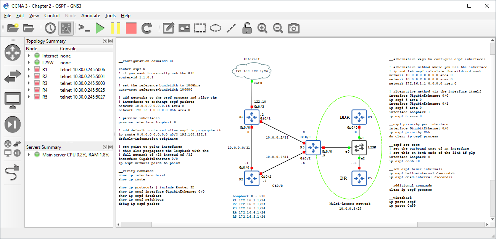

# Basic networking labo's

Deze repository bevat alle oefeningen en labo's voor het Basis netwerken boek. 

In de `labs` map vind je voor elk hoofdstuk oefeningen. Deze zijn bedoeld om je meer inzicht te geven in de behandelde materie.

Voor sommige van deze oefeningen ga je gebruik maken van een netwerk simulator. GNS3 (Graphical Network simulator 3) is een gratis network simulator. Dit houdt in dat je met deze tool op je computer een netwerk kan bouwen en dit doet zich voor als een echt netwerk. Zo kan je een virtueel netwerk labo bouwen doorheen het boek.

Met GNS3 ben je ook niet beperkt in de schaal van je netwerk dat je wenst te bouwen. Zolang je genoeg resources vrij hebt op je computer kom je al een heel eind. 

# Installatie van GNS3
Hoe je GNS3 moet installeren en configureren vind je terug in de [installatie gids](installation/gns3.md). 

De gids heeft zowel instructies voor VmWare workstation en Virtualbox.

## Nodige software en images

Bijna alle images van toestellen die we gebruiken in GNS3 zijn gratis te verkrijgen. Een uitzondering zijn de routers en switches. Voor de routers en switches gaan we gebruik maken van de Cisco IOSv en IOSvL2 images. Deze kan je verkrijgen als je een Cisco CML licentie aankoopt. Je kan de nodige info hier vinden: https://www.cisco.com/c/en/us/products/cloud-systems-management/modeling-labs

## Labo's

Indien je nog geen ervaring hebt met GNS3 is het aan te raden eerst het introductielabo te volgen: [gns3-introductie](labs/gns3-introductie/gns3-introductie.md)

-   01 - Wat is een netwerk
    - [Lab-01-01](labs/hoofdstuk-01/lab-01-01.md) 
-   02 - Basis services en tools
    - [Lab-02-01](labs/hoofdstuk-02/lab-02-01.md)  
    - [Lab-02-02](labs/hoofdstuk-02/lab-02-02.md)  
-   03 - Communicatieprotocollen
    - [Lab-03-01](labs/hoofdstuk-03/lab-03-01.md)  
-   04 - De physical layer
    - [Lab-04-01](labs/hoofdstuk-04/lab-04-01.md)  
-   05 - De data link layer
    - [Lab-05-01](labs/hoofdstuk-05/lab-05-01.md)  
    - [Lab-05-02](labs/hoofdstuk-05/lab-05-02.md)  
-   06 - De network layer
    - [Lab-06-01](labs/hoofdstuk-06/lab-06-01.md)  
    - [Lab-06-02](labs/hoofdstuk-06/lab-06-02.md)  
    - [Lab-06-03](labs/hoofdstuk-06/lab-06-03.md)  
-   07 - Subnetting en vlsm
-   08 - Routing
    - [Lab-08-01](labs/hoofdstuk-08/lab-08-01.md)  
    - [Lab-08-02](labs/hoofdstuk-08/lab-08-02.md)  
    - [Lab-08-03](labs/hoofdstuk-08/lab-08-03.md)  
-   09 - De transport layer
    - [Lab-09-01](labs/hoofdstuk-09/lab-09-01.md)  
    - [Lab-09-02](labs/hoofdstuk-09/lab-09-02.md)  
-   10 - NAT
    - [Lab-10-01](labs/hoofdstuk-10/lab-10-01.md)  
    - [Lab-10-02](labs/hoofdstuk-10/lab-10-02.md)  
-   11 - VLANs
    - [Lab-11-01](labs/hoofdstuk-11/lab-11-01.md)  
    - [Lab-11-02](labs/hoofdstuk-11/lab-11-02.md)  
    - [Lab-11-03](labs/hoofdstuk-11/lab-11-03.md)  
-   12 - Redundantie
    - [Lab-12-01](labs/hoofdstuk-12/lab-12-01.md)  
    - [Lab-12-02](labs/hoofdstuk-12/lab-12-02.md)  
-   13 - Netwerken bouwen
    - [Lab-13-01](labs/hoofdstuk-13/lab-13-01.md)  