# GNS3 installeren en configureren

We willen op het einde de volgende opstelling:

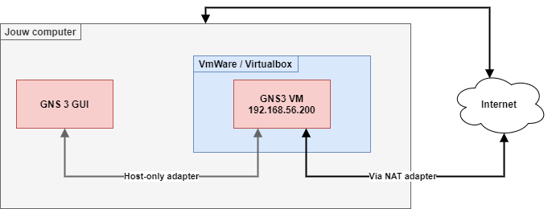

## Stappenplan

1. Een gratis GNS3 account aanmaken
    - [https://www.gns3.com/account/register](https://www.gns3.com/account/register)
2. De GNS3 vm downloaden voor jouw platform
    - [https://www.gns3.com/software/download-vm](https://www.gns3.com/software/download-vm)
3. De GNS3 gui downloaden
    - [https://www.gns3.com/software/download](https://www.gns3.com/software/download)
4. Gebruik maken van VmWare of Virtualbox
    - Installatiegids voor [VmWare Workstation](vmware.md)
    - Installatiegids voor [Virtualbox](virtualbox.md)
5. De GNS3 gui installeren
6. De GNS3 gui koppelen aan de GNS3 vm
7. De juiste images importeren in GNS3
8. De images voorzien van de juiste basis instellingen

# Een GNS3 labo opzetten

Doorheen deze gids worden alleen de noodzakelijke stappen aangeduid zodat het geheel wat overzichtelijk blijft.

## De nodige items downloaden en een account maken

Maak een GNS3 account aan en download alles wat nodig is. Plaats dit best in een apart mapje zodat je zeker weet dat je alles hebt. Download de correcte GNS3 vm voor ofwel VmWare of voor Virtualbox.

Wanneer je alles hebt ziet het er als volgt uit (in het geval van virtualbox):

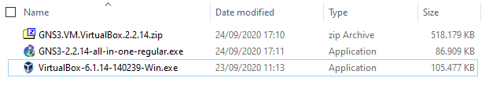

Let op dat tijdens het schrijven van deze cursus we GNS3 versie 2.2.14 gebruiken. Jouw versie kan dus hoger zijn. Dit is geen erg. Belangrijk is wel dat de versie van de GNS3 gui gelijk is aan die van de GNS3 vm.

## Gebruik maken van VmWare of Virtualbox

- Installatiegids voor [VmWare Workstation](vmware.md)
- Installatiegids voor [Virtualbox](virtualbox.md)

## De GNS3 gui installeren

Start nu de installatie van de GNS3 gui. Kies de volgende componenten:

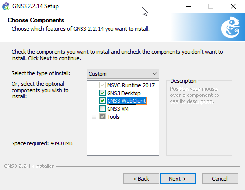

GNS3 installeert ook enkele andere programma's. Deze mag je gewoon mee installeren. De gratis rommel van solarwinds mag je gerust negeren.

Op het einde mag je de GNS3 gui laten starten.

## De GNS3 gui koppelen aan de GNS3 vm

Wanneer je GNS3 voor de eerste keer start kies je als optie **remote server**

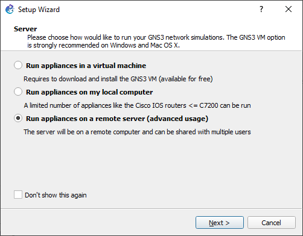

Vul de volgende instellingen in:

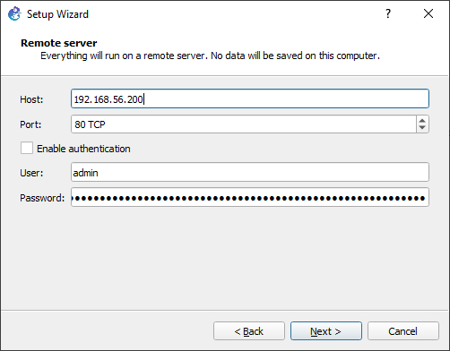

Als alles correct is verlopen zie je nu aan de rechterkant je server staan:

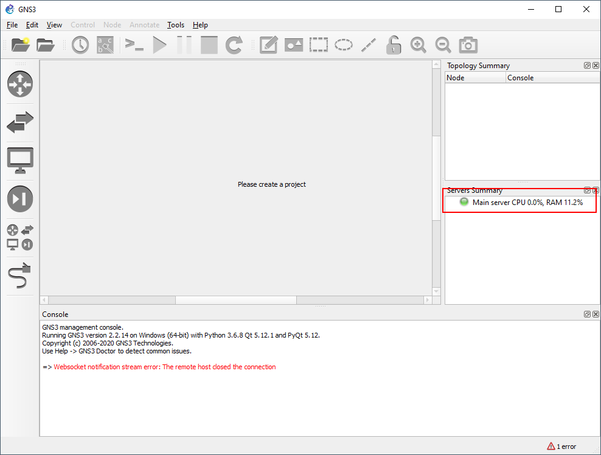

## Enkele basis instellingen configureren

Open **edit > preferences. **Onder het tabblad topology view kies je de volgende instellingen en verander je het font in consolas (of iets anders wat je leuk vind).

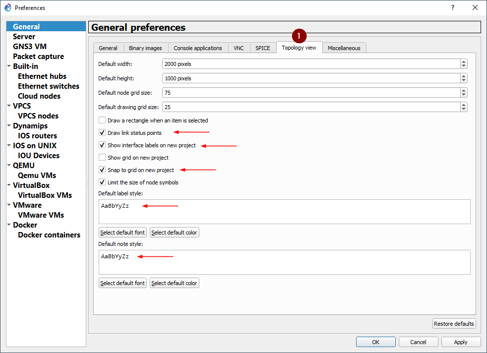

## De juiste images importeren in GNS3

Er zijn 2 soorten images in GNS3. Gratis open images en images waar je een licentie voor nodig hebt. 

We hebben de volgende images nodig in ons GNS3 labo:

- Firewalls
    - Pfsense
- Guests
    - Toolbox
    - Webterm
- Routers
    - Cisco IOSv (via opleiding/CML/Virl licentie)
- Switches
    - Cisco IOSvL2 (via opleiding/CML/Virl licentie)

Allereerst installeren we Pfsense.

Kies in de GNS3 gui voor **file > new template**. Kies dan voor **Install an appliance from the GNS3 server**.

Voor Pfsense klik je Firewalls open en scroll je omlaag naar PfSense:

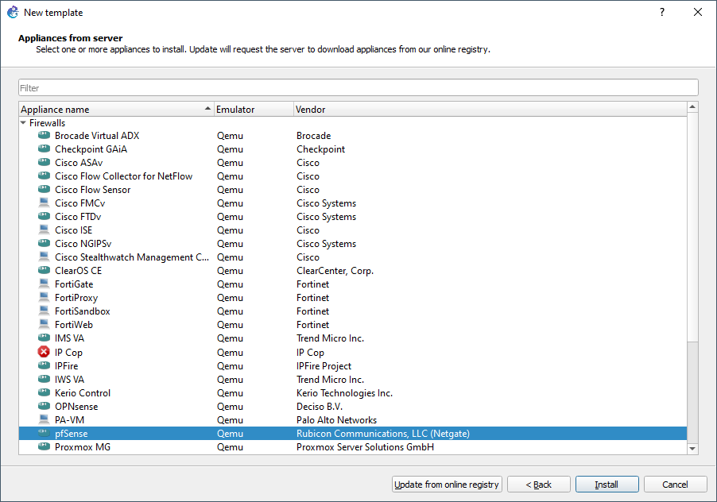

Klik dan op **install** en kies in het volgende venster voor **install the appliance on the main server**. De standaard QEMU binary is ok.

Je ziet in het volgende venster de versies van pfsense die ondersteund worden en de ontbrekende bestanden. Wij gaan alleen maar voor de laatst nieuwe versie 

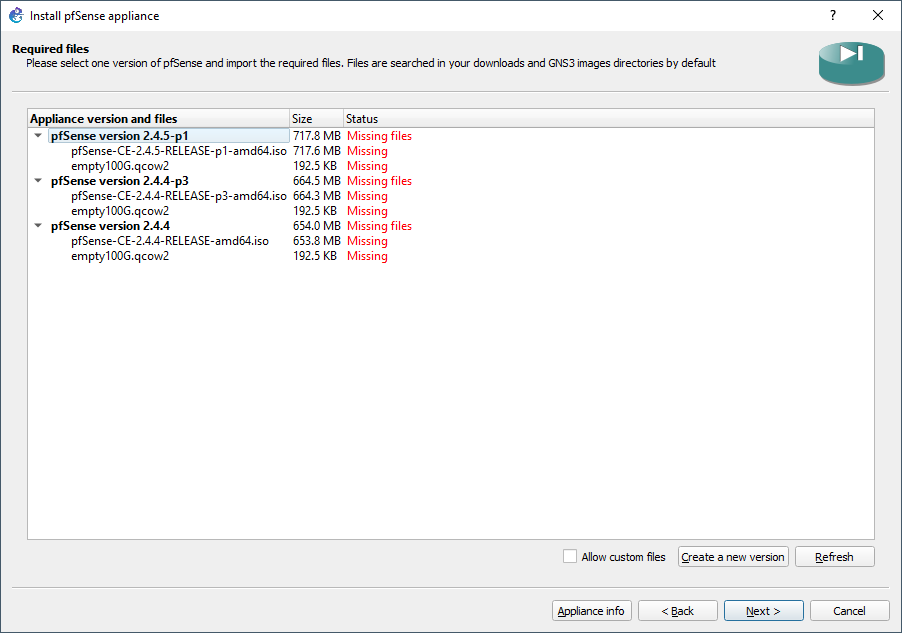

Als je nu de bovenste pfsense versie selecteert zie je een download knop komen. Door hierop te klikken word je automatisch naar de download geleid die je nodig hebt. Kijk wel goed naar de bestandsnaam zodat je de correcte hebt.

Doe dit zowel voor de pfsense file en voor de **empty100G **file. Zodra je deze gedownload hebt kun je deze importen. Het importeren kan even duren omdat GNS3 de image nakijkt.

Als dit in orde is zie je dat onze pfsense versie automatisch dichtklikt. Je kan nu deze selecteren en op **next** klikken. Wanneer dan gevraagd wordt om deze image te installeren kies je **yes**.

Wanneer je nu in de firewall categorie gaat kijken kan je je pfsense versie zien:

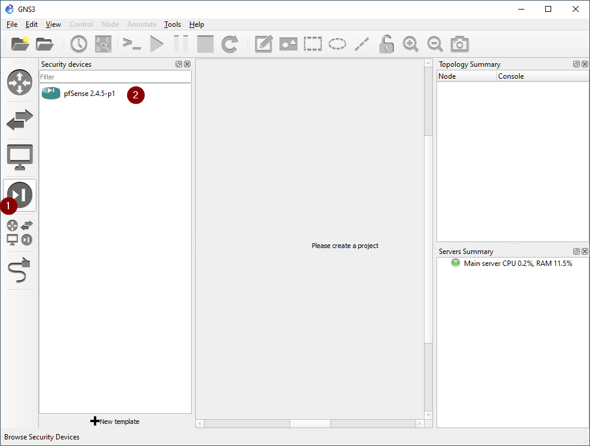

Doe hetzelfde voor de Guests en voor de cisco images. Voor de cisco images is er geen download knop. Deze moet je zelf weten te bemachtigen met een geldige licentie en dan importeren.

De guests zijn gewoon docker machines. Deze kan je gewoon op next klikken totdat deze geïnstalleerd zijn. Hier heb je geen images voor nodig.

## De basisinstellingen van de images instellen

Als voorbeeld nemen we de pfsense image. De methode blijft hetzelfde ongeacht de image die je wenst aan te passen.

Rechtsklik op de pfsense image in de zijbalk en kies voor **configure template**. We passen de volgende instellingen aan:

- Template name
    - pfSense (optioneel maar ik heb het graag overzichtelijk)
- Default name format
    - PF-{0}
- Symbol
    - :/symbols/affinity/square/blue/firewall.svg (grijs of rood mag ook)

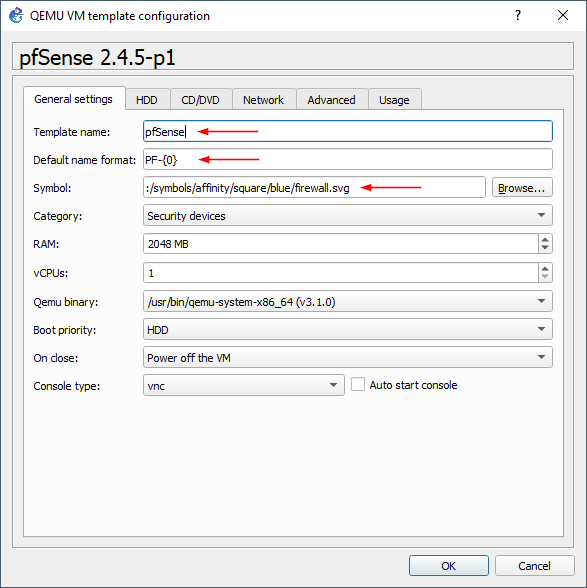

Je kan nu in de zijbalk zien dat pfsense met het juiste symbool en naam wordt weergegeven.

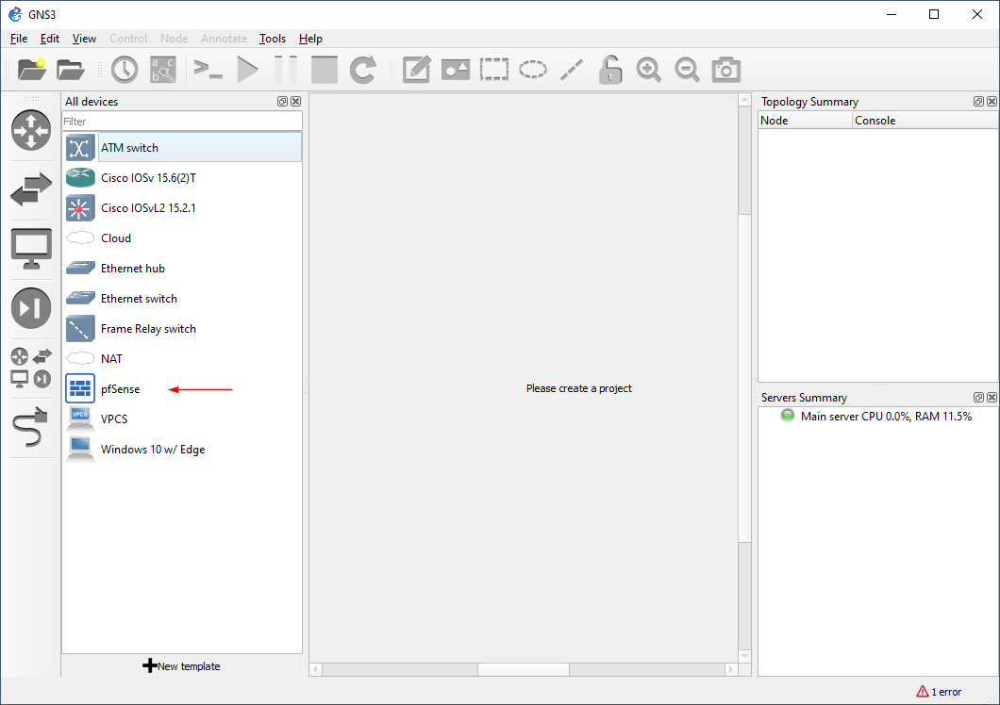

Het aanpassen van deze images is optioneel in de zin van dat dit de werking niet beïnvloedt. Echter moet je er dan wel rekening mee houden dat je bij het maken van opdrachten visuele verschillen kan hebben.

Gebruik hiervoor de volgende instellingen:

- Toolbox
    - Template name
        - Toolbox
    - Default name format
        - SRV-{0}
    - Symbol
        - :/symbols/affinity/square/gray/server.svg
- Webterm
    - Template name
        - Webterm
    - Default name format
        - WEB-{0}
    - Symbol
        - :/symbols/affinity/square/gray/client.svg
- Cisco IOSvL2 (switch)
    - Template name
        - Cisco IOSvL2
    - Default name format
        - SW-{0}
    - Symbol
        - :/symbols/affinity/square/blue/switch.svg
- Cisco IOSv (router)
    - Template name
        - Cisco IOSv
    - Default name format
        - R-{0}
    - Symbol
        - :/symbols/affinity/circle/blue/router.svg

### Een extra layer 2 switch en VPCS aanmaken

Voor het wat mooier en overzichtelijker te maken moet je vlug ook een nieuwe layer 2 switch aanmaken binnen GNS3. De reden is dat je de standaard templates niet mag aanpassen.

Open **edit > preferences** en selecteer links **Ethernet switches**. Klik onderaan op new en maak een nieuwe switch aan met als naam **L2 Switch**. Als deze aangemaakt is klik je onderaan op edit en kies je de volgende instellingen:

- L2 Switch
    - Template name
        - L2 Switch
    - Default name format
        - L2-SW-{0}
    - Symbol
        - :/symbols/affinity/square/gray/switch.svg

Doe hetzelfde voor een VPCS met de volgende instellingen:

- VPCS
    - Template name
        - VPCS
    - Default name format
        - PC-{0}
    - Symbol
        - :/symbols/affinity/square/gray/client.svg