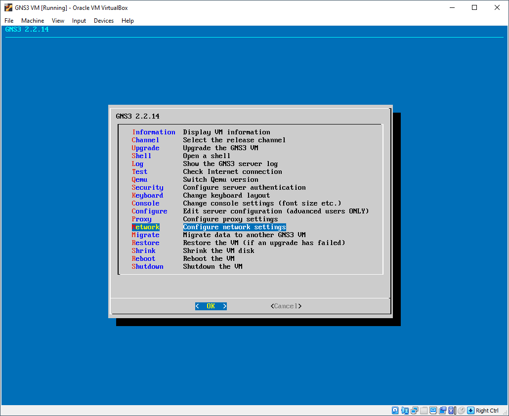

# De GNS3 vm installeren in VirtualBox

# GNS3 installeren in Virtualbox

Doorheen deze gids worden alleen de noodzakelijke stappen aangeduid zodat het geheel wat overzichtelijk blijft.


## VT-x of AMD-v enablen in je uefi

Deze instelling is nodig zodat je in je virtuele machine ook andere virtuele machines kan draaien. Je gaat nl netwerk hardware emuleren binnen je GNS3 vm. Hoe je dit moet doen hangt volledig af van computer tot computer. 

Deze instelling ziet er vaak uit onder de noemer "virtualization"


Als dit niet in orde is krijg je de volgende melding:


## Virtualbox installeren

Start de installatie van virtualbox. Je mag alle features laten aan staan:


Waar en hoe je je shortcuts plaatst is naar keuze. Zie wel dat je de file associations registered!


De rest van de installatie mag je gewoon doorlopen en op het einde kies je voor virtualbox te starten.


## De GNS3 vm importeren in virtualbox

Unzip de GNS3 vm die je reeds gedownload hebt. Wanneer deze uitgepakt is zie je dat deze nu een gekend bestandstype is waar je meteen op kan dubbelklikken.

_Mocht dit niet zo zijn moet je gewoon in virtualbox file > import appliance kiezen en dan het bestand selecteren._

Zodra je dubbel klikt gaat er een nieuw venster open in virtualbox. Alle instellingen zijn voorzien van een standaard die je (nog) niet kan aanpassen. Als je het wenst kan je eventueel wel de map aanpassen waar de virtuele machine geplaatst wordt.


Als je overal mee akkoord bent klik je op import en wacht je tot dit klaar is. Dit kan even duren.


## De instellingen van de GNS3 vm aanpassen

Rechtsklik op je GNS3 vm en kies **settings.**

Kies links System. Op het Motherboard tabblad geef je de GNS3 vm minstens 4096Mb geheugen:


In het tabblad Processor vink je **enable nested VT-x/AMD-V** aan en ken je minstens 4 cores toe:


**_Indien het vakje grijs blijft kijk dan zeker na of je alles correct hebt ingesteld in jouw bios/uefi. Mocht dit juist staan dan moet je even via de command line de volgende commando's uitvoeren. Gebruik hiervoor powershell:_**


```
cd %programfiles%\Oracle\VirtualBox
.\VBoxManage modifyvm "GNS3 VM" --nested-hw-virt on
```


In de netwerkinstellingen kies je voor **adapter 1** de optie **NAT**:


Selecteer dan **adapter 2**, enable deze en stel deze in als **Host-only Adapter**:


## De GNS3 vm een statisch ip geven

Je mag nu op de startknop klikken van de GNS3 vm. Wacht tot de GNS3 vm gestart is. Dit kan even duren. Als je een venster krijgt van Windows defender firewall moet je even ook private networks aanvinken en toelaten:


Als de GNS3 vm gestart is zie je het volgende scherm:


Klik nu met je muis in het venster en duw op enter. Ga met de pijltjes naar onder en kies voor network. Antwoord yes op de vraag.



Pas de instellingen aan zoals het voorbeeld hieronder. Let wel op dat dit het YAML formaat is. **Spaties zijn zeer belangrijk!**


Duw nu op **ctrl + o en **dan op enter om het bestand op te slaan. Sluit de editor af met **ctrl + x**. De GNS3 vm gaat nu automatisch herstarten.

Als alles goed verlopen is zie je nu op het beginscherm het juiste ip adres staan.


Als je nu surft naar [http://192.168.56.200](http://192.168.56.200) krijg je de web interface te zien:

