# De GNS3 vm installeren in VmWare

# GNS3 installeren in VmWare

Doorheen deze gids worden alleen de noodzakelijke stappen aangeduid zodat het geheel wat overzichtelijk blijft.


## VT-x of AMD-v enablen in je uefi

Deze instelling is nodig zodat je in je virtuele machine ook andere virtuele machines kan draaien. Je gaat namelijk netwerk hardware emuleren binnen je GNS3 vm. Hoe je dit moet doen hangt volledig af van computer tot computer.  Deze instelling ziet er vaak uit onder de noemer "virtualization"

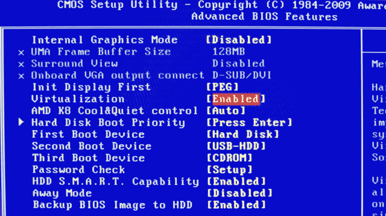
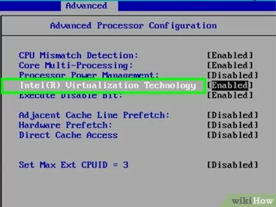

Als dit niet in orde is krijg je de volgende melding:

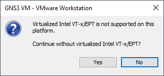

## VmWare Workstation installeren

Start de installatie van VmWare. De enhanced keyboard driver heb je niet nodig.

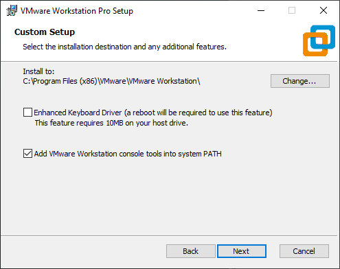

Je kiest om niet bij elke opstart voor updates te zoeken en je stuurt ook geen gegevens door:

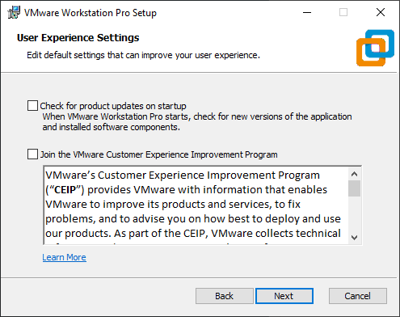

Waar en hoe je je shortcuts plaatst is naar keuze. 

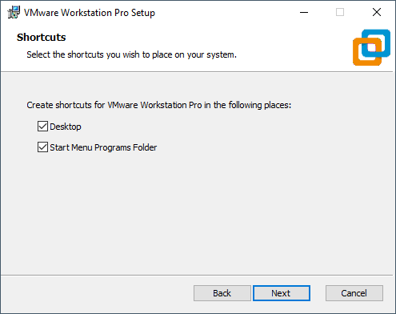

De rest van de installatie mag je gewoon doorlopen en op het einde geef je je license key in als je deze hebt.


## De GNS3 vm importeren in VmWare

Unzip de GNS3 vm die je reeds gedownload hebt. Wanneer deze uitgepakt is zie je dat deze nu een gekend bestandstype (.ova) is waar je meteen op kan dubbelklikken.

_Mocht dit niet zo zijn moet je gewoon in Vmware file > open kiezen en dan het bestand selecteren._

Zodra je dubbel klikt gaat er een nieuw venster open in VmWare. In het volgende venster kan je een naam en een map kiezen voor de VM.

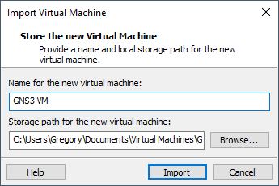

Als je overal mee akkoord bent klik je op import en wacht je tot dit klaar is. Dit kan even duren.


## De instellingen van de GNS3 vm aanpassen

Rechtsklik op je GNS3 vm en kies **settings.**

Kies links Memory. Geef de GNS3 vm minstens 4096 MB geheugen:

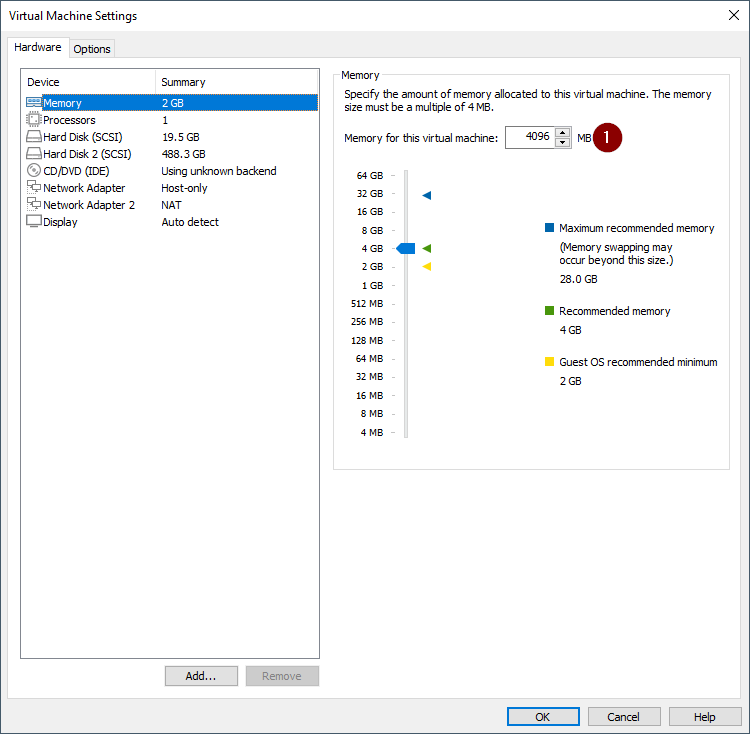

In het tabblad Processors vink je **Virtualize Intel VT-x/EPT or AMD-V/RVI** aan en ken je minstens 4 cores toe:


Kijk even na of Network adapter op host only is ingesteld en Network adapter 2 op NAT:

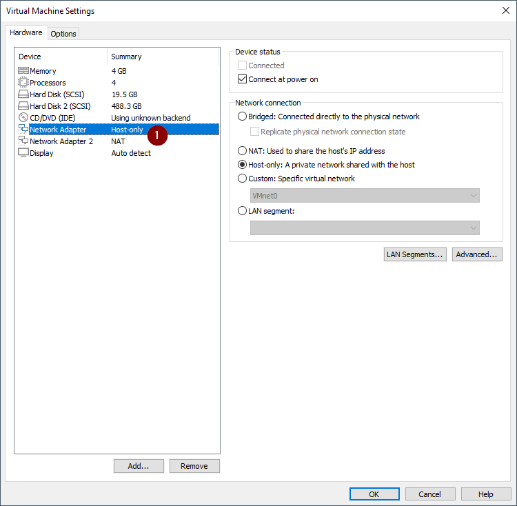

Als dit alles klaar is klik je ok om alles op te slaan.


## De netwerk instellingen van VmWare correct instellen

Voor dat we de VM starten gaan we even zorgen dat alle netwerken in VmWare correct zijn ingesteld. Start hiervoor de netwerk editor door te klikken op Edit > Virtual Network Editor:

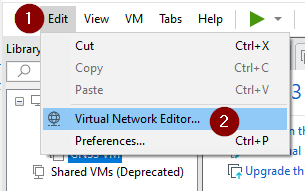

Kies rechts beneden change settings:

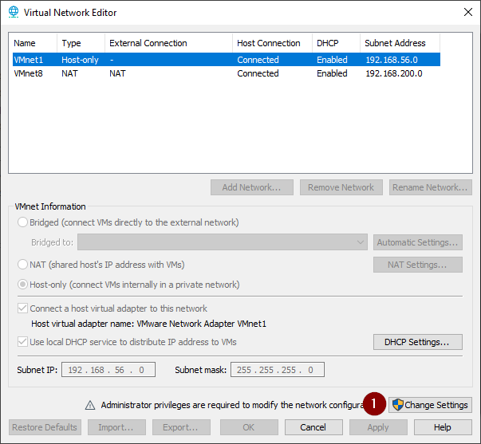

Je Krijgt nu alle gekende netwerken te zien. Voor ons zijn VMnet 1 en VMnet 8 belangrijk. 

Selecteer VMnet1 en geef als subnet ip 192.168.56.0 in, vink ook de optie voor dhcp en een host adapter aan:

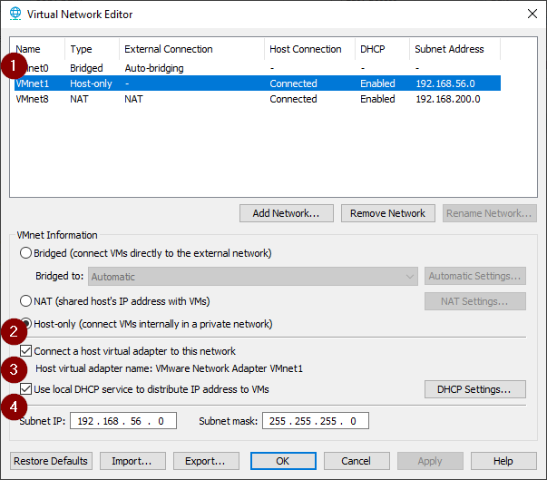

Doe hetzelfde voor VMnet 8 maar kies hier voor 192.168.200.0 als subnet:

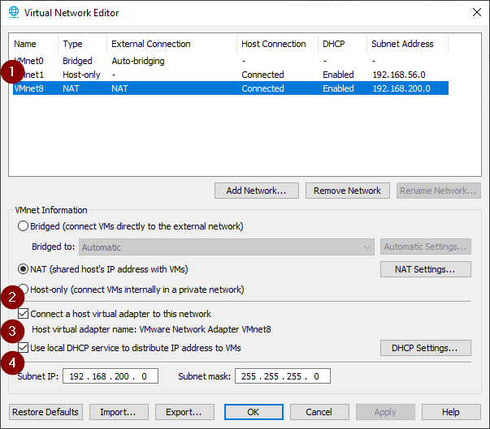

## De GNS3 vm een statisch ip geven

Je mag nu op de startknop klikken van de GNS3 vm. Wacht tot de GNS3 vm gestart is. Dit kan even duren. Als je een venster krijgt van Windows defender firewall moet je even ook private networks aanvinken en toelaten

Als de GNS3 vm gestart is zie je het volgende scherm:

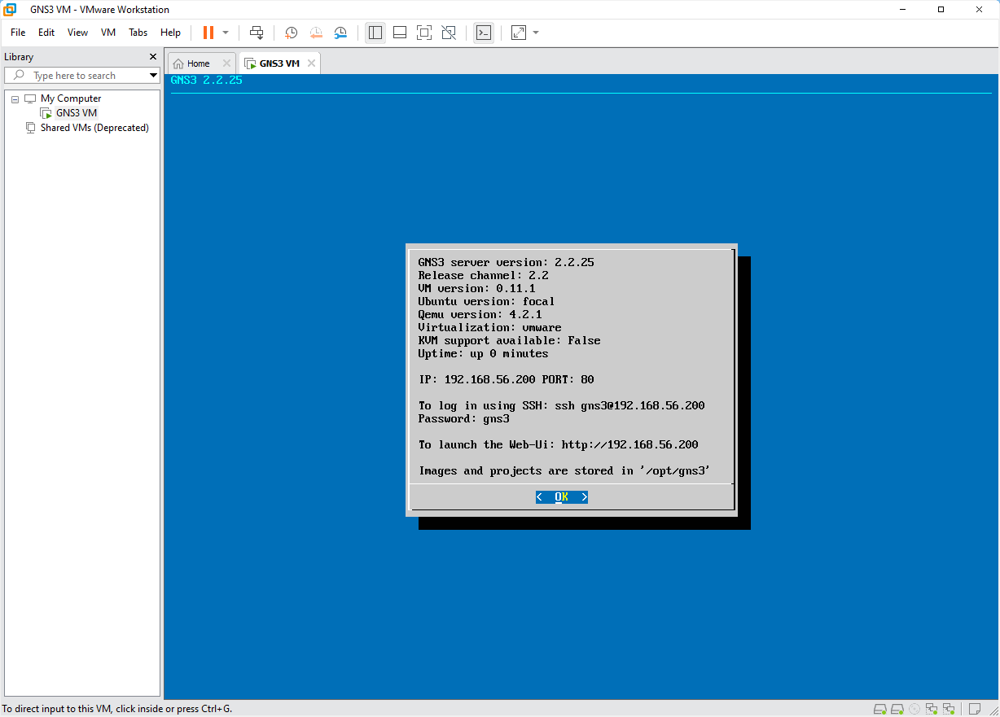

Klik nu met je muis in het venster en duw op enter. Ga met de pijltjes naar onder en kies voor network. Antwoord yes op de vraag.

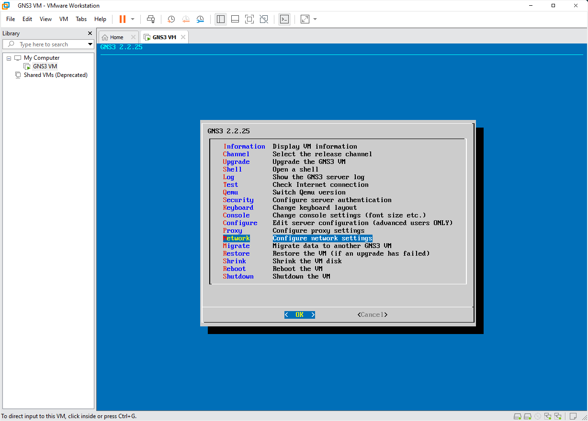

Pas de instellingen aan zoals het voorbeeld hieronder. Let wel op dat dit het YAML formaat is. **Spaties zijn zeer belangrijk!**

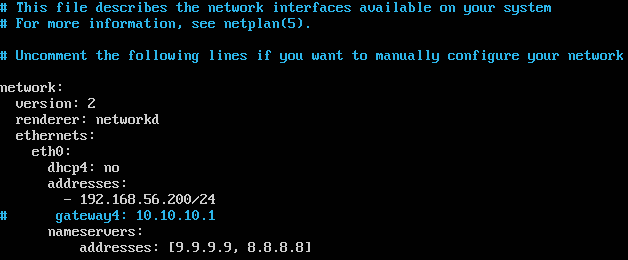

Duw nu op **ctrl + o en **dan op enter om het bestand op te slaan. Sluit de editor af met **ctrl + x**. De GNS3 vm gaat nu automatisch herstarten.

Als alles goed verlopen is zie je nu op het beginscherm het juiste ip adres staan.

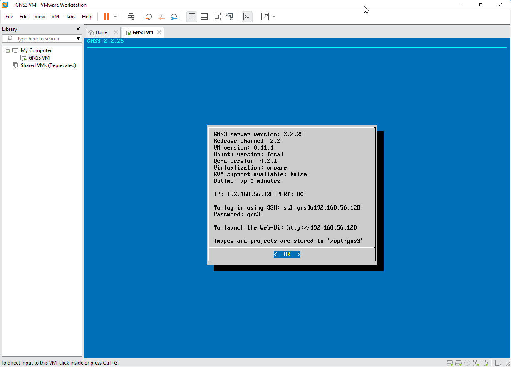

Als je nu surft naar [http://192.168.56.200](http://192.168.56.200) krijg je de web interface te zien:

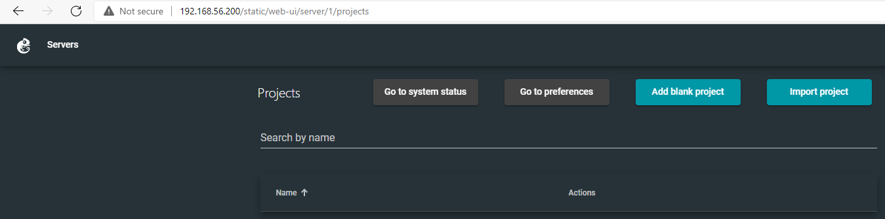

## Mogelijke issues

Mogelijks zijn er nog enkele issues die je kan ervaren wanneer de de virtuele machine wenst te starten. Zo kan je bijvoorbeeld de volgende foutmelding krijgen:

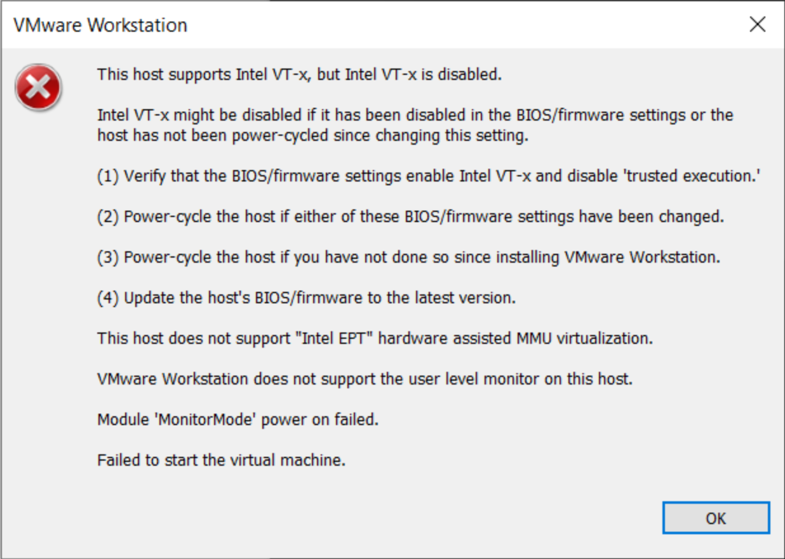

Dit heeft te maken met het feit dat er in jouw windows mogelijks Hyper-V ingeschakeld staat. Dit is omdat onderliggend VmWare gaat proberen Hyper-V te gebruiken. Voor normale virtuele machines is dit geen probleem - echter heb je voor GNS3 nested virtualisation nodig, wat niet gaat werken.

De enige oplossing is om Hyper-V volledig te verwijderen spijtig genoeg. Een euvel hierbij is wel dat je enkel nog gebruik kan maken van WSL v1.

> **Let op:** Om deze stappen te volgen moet je bepaalde security instellingen wijzigen. Evalueer dit zeker ten op zichte van jouw eigen security posture.
>
> Tevens gaan we voor de zekerheid alles verwijderen  van WSL. Je kan dus mogelijks al jouw WSL distro's verliezen! Mocht je toch willen gebruik maken van WSL dan kan je je distros omvormen naar versie 1. Refereer hiervoor naar het **WSL v1 installeren**.

Je moet de volgende stappen volgen:

- Bitlocker uitschakelen; indien je dit gebruikt.

  - Je kan de voortgang hier van volgen met het `manage-bde -status` commando. Zodra de teller 0,0% bereikt is alles klaar.

- Secure boot uitschakelen

  - Dit is anders voor elke machine. Je kan dit vinden in jouw UEFI.

- In jouw Microsoft Defender de optie **memory integrity** uitschakelen. Je kan deze vinden onder `Device security > memory integrity details`

- De volgende 2 register sleutels verwijderen met `regedit`

  - `HKEY_LOCAL_MACHINE\SYSTEM\CurrentControlSet\Control\DeviceGuard\EnableVirtualizationBasedSecurity`
  - `HKEY_LOCAL_MACHINE\SYSTEM\CurrentControlSet\Control\DeviceGuard\RequirePlatformSecurityFeatures`

- De nodige windows features verwijderen. Dit kan zowel manueel via de GUI of via powershell

  - In de **turn windows features on or off** gui moet je enkele features uitschakelen. Mogelijks bestaan deze niet allemaal op jou systeem.

    - `Hyper-V`, `Virtual Machine Platform`, `Windows Hypervisor Platform` en `Windows Sybsystem for Linux`.

  - Via een powershell admin prompt doe je dit met de volgende commandos:

    - ```powershell
      Disable-WindowsOptionalFeature -Online -FeatureName Microsoft-Hyper-V-Hypervisor
      Disable-WindowsOptionalFeature -Online -FeatureName Microsoft-Hyper-V-All
      Disable-WindowsOptionalFeature -Online -FeatureName Microsoft-Windows-Subsystem-Linux
      ```

- Zorg er voor dat Hyper-V niet automatisch mee opstart. Voer dit uit in een powershell admin prompt

  - `bcdedit /set hypervisorlaunchtype off`


- De computer herstarten

- Voer in een powershell admin prompt het commando `systeminfo` uit. Normaal moet je onderaan de volgende output krijgen


    - ```
        Hyper-V Requirements:      VM Monitor Mode Extensions: Yes
                                   Virtualization Enabled In Firmware: Yes
                                   Second Level Address Translation: Yes
                                   Data Execution Prevention Available: Yes
        ```

    - Als je bovenstaande output krijgt te zien is alles in orde.


#### WSL v1 installeren

Let op, niet alle commando's hieronder gaan werken wanneer niet alle componenten geinstalleerd zijn. Op het einde gaat dit sowiezo in orde zijn.

Indien je bovenstaande stappen hebt gevolgd heb je geen WSL meer op jouw machine. Je kan WSL1 als volgt installeren in een powershell admin prompt:

```powershell
# Voor de zekerheid mocht er al een wsl install zijn
wsl --set-default-version 1

## WSL runtime installeren
# Windows 10 installeert versie 1 standaard
wsl --install --no-distribution
# Windows 11 moet je WSL v1 forceren
wsl --install --enable-wsl1 --no-distribution

# Mocht je bestaande distributions hebben
wsl --install Ubuntu-22.04
wsl --unregister Ubuntu

# Kijken wat bestaat
wsl --list --online
wsl --install -d Ubuntu-22.04
```

Indien je **bestaande distros hebt** kan je deze omvormen naar WSL v1:

```powershell
wsl --list
# Voor alle distros
wsl --set-version <distro_name> 1

# WSL standaard op versie 1 zetten
wsl --set-default-version 1
```

Referente links:

- https://learn.microsoft.com/en-us/windows/security/identity-protection/credential-guard/configure?tabs=intune
