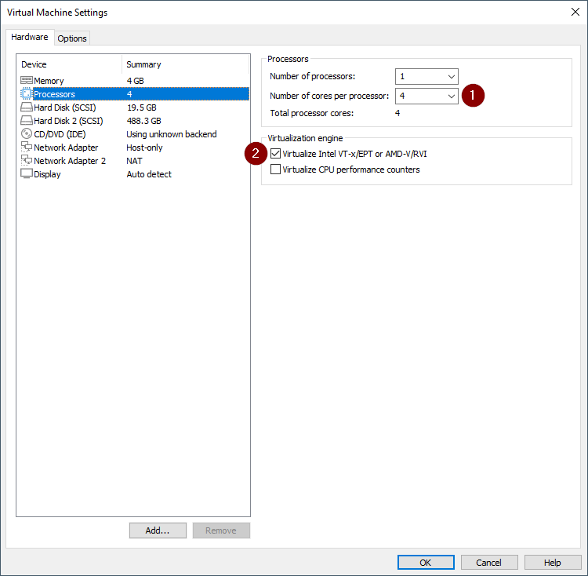

# De GNS3 vm installeren in VmWare

# GNS3 installeren in VmWare

Doorheen deze gids worden alleen de noodzakelijke stappen aangeduid zodat het geheel wat overzichtelijk blijft.

## VT-x of AMD-v enablen in je uefi

Deze instelling is nodig zodat je in je virtuele machine ook andere virtuele machines kan draaien. Je gaat namelijk netwerk hardware emuleren binnen je GNS3 vm. Hoe je dit moet doen hangt volledig af van computer tot computer.  Deze instelling ziet er vaak uit onder de noemer "virtualization"

Als dit niet in orde is krijg je de volgende melding:

## VmWare Workstation installeren

Start de installatie van VmWare. De enhanced keyboard driver heb je niet nodig.

Je kiest om niet bij elke opstart voor updates te zoeken en je stuurt ook geen gegevens door:

Waar en hoe je je shortcuts plaatst is naar keuze. 

De rest van de installatie mag je gewoon doorlopen en op het einde geef je je license key in als je deze hebt.

## De GNS3 vm importeren in VmWare

Unzip de GNS3 vm die je reeds gedownload hebt. Wanneer deze uitgepakt is zie je dat deze nu een gekend bestandstype (.ova) is waar je meteen op kan dubbelklikken.

_Mocht dit niet zo zijn moet je gewoon in Vmware file > open kiezen en dan het bestand selecteren._

Zodra je dubbel klikt gaat er een nieuw venster open in VmWare. In het volgende venster kan je een naam en een map kiezen voor de VM.

Als je overal mee akkoord bent klik je op import en wacht je tot dit klaar is. Dit kan even duren.

## De instellingen van de GNS3 vm aanpassen

Rechtsklik op je GNS3 vm en kies **settings.**

Kies links Memory. Geef de GNS3 vm minstens 4096 MB geheugen:

In het tabblad Processors vink je **Virtualize Intel VT-x/EPT or AMD-V/RVI** aan en ken je minstens 4 cores toe:

Kijk even na of Network adapter op host only is ingesteld en Network adapter 2 op NAT:

Als dit alles klaar is klik je ok om alles op te slaan.

## De netwerk instellingen van VmWare correct instellen

Voor dat we de VM starten gaan we even zorgen dat alle netwerken in VmWare correct zijn ingesteld. Start hiervoor de netwerk editor door te klikken op Edit > Virtual Network Editor:

Kies rechts beneden change settings:

Je Krijgt nu alle gekende netwerken te zien. Voor ons zijn VMnet 1 en VMnet 8 belangrijk. 

Selecteer VMnet1 en geef als subnet ip 192.168.56.0 in, vink ook de optie voor dhcp en een host adapter aan:

Doe hetzelfde voor VMnet 8 maar kies hier voor 192.168.200.0 als subnet:

## De GNS3 vm een statisch ip geven

Je mag nu op de startknop klikken van de GNS3 vm. Wacht tot de GNS3 vm gestart is. Dit kan even duren. Als je een venster krijgt van Windows defender firewall moet je even ook private networks aanvinken en toelaten

Als de GNS3 vm gestart is zie je het volgende scherm:

Klik nu met je muis in het venster en duw op enter. Ga met de pijltjes naar onder en kies voor network. Antwoord yes op de vraag.

Pas de instellingen aan zoals het voorbeeld hieronder. Let wel op dat dit het YAML formaat is. **Spaties zijn zeer belangrijk!**

Duw nu op **ctrl + o en **dan op enter om het bestand op te slaan. Sluit de editor af met **ctrl + x**. De GNS3 vm gaat nu automatisch herstarten.

Als alles goed verlopen is zie je nu op het beginscherm het juiste ip adres staan.

Als je nu surft naar [http://192.168.56.200](http://192.168.56.200) krijg je de web interface te zien:

## Mogelijke issues

Mogelijks zijn er nog enkele issues die je kan ervaren wanneer de de virtuele machine wenst te starten. Zo kan je bijvoorbeeld de volgende foutmelding krijgen:

Dit heeft te maken met het feit dat er in jouw windows mogelijks Hyper-V ingeschakeld staat. Dit is omdat onderliggend VmWare gaat proberen Hyper-V te gebruiken. Er zijn verschillende dingen die je kan proberen om dit op te lossen:

- In een admin cmd prompt "`bcdedit /set hypervisorlaunchtype off`" uitvoeren en de computer herstarten.
- Virtualization based security uitschakelen.
    - Winkey + R
    - Gpedit.msc
    - `Local Group Policy Editor > Computer Configuration > Administrative Templates > System > Device Guard`
    - "`Turn On Virtualization Based Security`" uitschakelen
    - De computer herstarten
- Add or remove windows features, "`Hyper-V`" en "`Virtual machine platform`"  uitschakelen en de computer herstarten.

Referentie links:
- https://kb.vmware.com/s/article/2146361
- https://docs.microsoft.com/en-us/troubleshoot/windows-client/application-management/virtualization-apps-not-work-with-hyper-v
- https://blogs.vmware.com/workstation/2020/05/vmware-workstation-now-supports-hyper-v-mode.html
