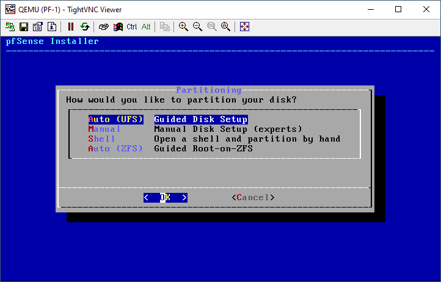
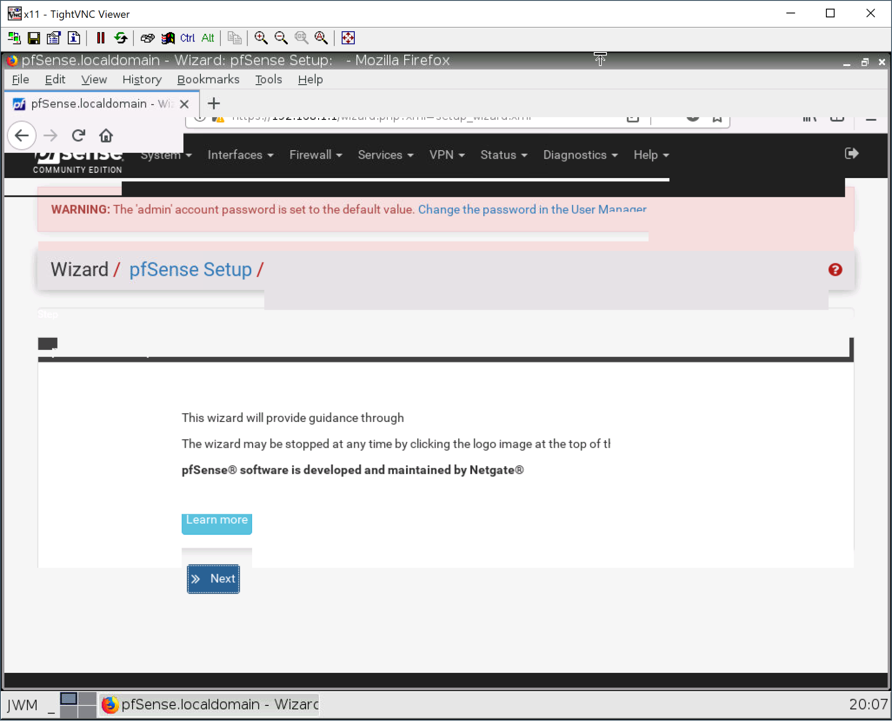

# Een eerste netwerk bouwen met GNS3

Bouw de volgende opstelling na in GNS3:

_De **NAT cloud** vind je in de **end devices** categorie. De NAT cloud voorziet connectiviteit naar het internet. Hiervoor maakt deze gebruik van het 192.168.122.0/24 subnet (192.168.122.1 tem 192.168.122.254). Hier zit een DHCP server in die je automatisch een IP adres aanreikt zodat je nog niet te veel hoeft te configureren._

Start nu het labo op met de groene play knop bovenaan in GNS3.

Wanneer je nu dubbelklikt op de webterm machine wordt je automatisch verbonden via vnc. De firefox browser wordt normaal automatisch geopend.** **Normaal als alles goed verlopen is heb je nu internet toegang.

Proficiat, Je hebt je eerste netwerk gebouwd met GNS3!

## VPCS

In de meeste opstellingen zie je dat er ook gebruik gemaakt gaat worden van VPCS ipv webterm . De reden is dat we vaak niet meer moeten doen dan een simpele ping test. Hiervoor hebben we geen hele linux omgeving nodig. Een VPCS verbruikt veel minder ram. Zeker wanneer je krap zit helpt dit.

Koppel een extra VPCS bij in je bestaande netwerk zodat je de volgende opstelling krijgt:

Als je nu dubbelklikt op PC-1 krijg je een basis terminal venster te zien:

Je kan nu het commando **dhcp** uitvoeren om automatisch een ip adres te krijgen (onthoud de DORA). Als je daarna dan het commando **show ip** uitvoert zie je dat dit gelukt is. Een ping naar google.be lukt ook. (beëindig de ping met **ctrl + c**):

# Een netwerk bouwen met pfSense

We gaan nu ons eerste netwerkje bouwen met pfSense. pfSense is een open source router en/of firewall distributie. Je kan deze breed inzetten van je thuisnetwerk tot een bedrijven netwerk.

Begin met de volgende opstelling te bouwen in GNS3:

Rechtsklik op PF-1 en kies start en dubbelklik dan op PF-1. Wanneer dit start zie je dat je niet zomaar pfSense kan gebruiken. Je moet dit eerst installeren. Laat de eerste opstart lopen tot je het volgende scherm kan zien:

Duw op enter om akkoord te gaan met de licentie en duw in het volgende venster nogmaals op enter om de installatie te starten.

Als keymap gaan we verder met de default (tenzij je echt een apart toetsenbord hebt is de default meer dan ok). Voor de disk setup kiezen we voor **Auto**:

pfSense begint nu te installeren:

Zodra de installatie klaar is krijg je nog een laatste vraag of je nog iets manueel wenst aan te passen. Antwoord hier gewoon **no** en dan **reboot** en pfSense start automatisch opnieuw op.

De volgende stap is onze WEB-1 appliance instellen zodat deze automatisch een adres via DHCP krijgt van de pfSense firewall. Rechtsklik hiervoor op WEB-1 in in onze opstelling en kies onderaan **edit** bij de network settings:

Pas de laatste 2 regels van de config aan door de # en spaties te verwijderen. De config ziet er dan als volgt uit:

Sla de config op en start WEB-1. Wanneer deze opgestart is krijg je meteen een browser te zien. Als alles correct is kan je hier mee surfen op het internet:

## pfSense benaderen via de webconsole

pfSense beheer je via de browser. Via de webinterface kan je alles instellen wat je wenst in pfSense.

Wij gaan nu de initiële configuratie doen. Eerst dubbelklik je op pfSense in je labo. In de interface kijk je dan welk ip adres je lan interface heeft. Dit is het ip dat je gaat gebruiken om pfSense te beheren. In dit geval is het ip **192.168.1.1**. Mocht dit bij jou een ander ip zijn dan moet je dit ip gebruiken uiteraard. Dit IP adres is tevens de default gateway van jouw netwerk.

Je kan nu dubbelklikken op je WEB-1 apparaat en dit ip adres ingeven in firefox. Wanneer je dit doet krijg je de login pagina te zien van pfSense:

De default login is "admin" met als wachtwoord "pfsense". Wanneer je hier mee aanmeldt kom je op de first run wizard uit. Hier worden al enkele basisinstellingen correct ingesteld:

Op het volgende scherm dat de support opties aangeeft mag je ook op next klikken. Je kan nu de hostname, domain name en dns servers kiezen.

Gebruik hier de volgende instellingen:

- Hostname
    - firewall
- Domain name
    - Lab.local
- Dns servers
    - 9.9.9.9
    - 8.8.8.8
- Override dns
    - Uitschakelen

Hierna kies je je ntp server en je tijdzone.

Gebruik hier de volgende instellingen:

- NTP server
    - be.pool.ntp.org
- Timezone
    - Europe/Brussels

Op het scherm voor je wan instellingen vink je gewoon "block RFC1918 private networks" uit.

In het volgende scherm laat je het lan ip onveranderd.

Geef in het volgend venster een veilig admin wachtwoord op:

En laat dan de configuratie herladen:

Als alles ok verlopen is krijg je het volgende scherm te zien:

Klik nu onderaan op finish en je krijgt dan de interface van pfSense te zien:

Proficiat, je hebt nu een basis opstelling met een werkende pfSense!