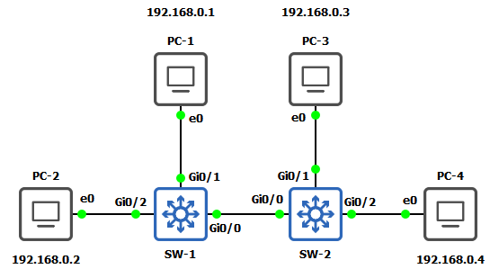

# Labo 05-01

In dit labo gaan we kijken hoe een switch mac adressen leert. Deze opstelling kan je vinden in [resources/gns3-labs/lab-05-01.gns3project.zip](../../resources/gns3-labs/lab-05-01.gns3project.zip).

Op elke VPCS kan je het ip en mac adres opvragen met het commando "`show ip`".



Begin met de opstelling te starten. Eens dat alle apparaten gestart zijn beginnen we met een schone lei. Dubbelklik op zowel SW-1 als SW-2. Voer hier de volgende commando's uit:


```
enable
clear mac address-table dynamic
show mac address-table
```


Normaal moet je nu een lege mac tabel (CAM) hebben.


## Cam tabellen in dezelfde switch

Ping nu eens van PC-1 naar PC-2. Als de ping gelukt is voer je het volgende uit op SW-2


```
show mac address-table
```


Wat zie je nu? Wat is er veranderd?


## Mac tabellen tussen switches

Ping nu eens van PC-1 naar PC-4. Vraag hierna op zowel SW-1 als SW-2 de mac tabel op.

Wat kan je waarnemen als je de 2 mac tabellen vergelijkt tussen de SW-1 en SW-2? Wat herken je?


## Flooding

Maak nogmaals de mac tabellen leeg op beide switches. Start wireshark op en capture de link tussen SW-2 en PC-3. Ping nu eens van PC-1 naar PC-4. Wat kan je waarnemen in wireshark?

Maak nu nogmaals de mac tabel leeg op SW2. Start de ping opnieuw op tussen PC-1 en PC-4. Wat zie je nu?
