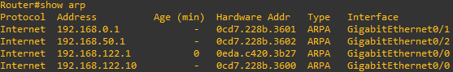

# Labo 06-01

In dit labo gaan we kijken hoe een routetabel er uit ziet en hoe ARP werkt. Deze opstelling kan je vinden in [resources/gns3-labs/lab-06-01.gns3project.zip](../../resources/gns3-labs/lab-06-01.gns3project.zip).

Start de opstelling. Dubbelklik op R1 en plaats jezelf in privileged exec mode met het "`enable`" commando. 

_Het "clear arp" commando gaat hier niet jouw tabel leegmaken omdat de router meteen hierna deze adressen weer opnieuw probeert te leren._

Vraag nu je ARP tabel op met het "`show arp`" commando. Je hebt nu een lege arp tabel met daarin alleen maar entries voor jouw eigen interfaces:

## Arp requests in hetzelfde netwerk

Start wireshark op op de verbinding tussen **PC-2 en SW-1**. Gebruik de "`arp`" filter. Open dan PC-1 en PC-2. Voer op beide PC's het commando "**show arp**" uit. Je kan nu zien dat je alleen maar het mac adres van je gateway hebt geleerd:

Ping nu van PC-1 naar PC-2. 

- Wat kan je zien in wireshark? 
- Wat is er veranderd in de arp tabel van PC-1 en PC-2?
- Wat is er veranderd in de arp tabel van R1?

Ping nu van PC-1 naar R1 (je gateway ip adres).

- Wat is er veranderd in de arp tabel van R1?

Stop wireshark en start wireshark op tussen **R1 en SW-2 **met de "`arp`" filter. Ping van PC-1 naar PC-3.

- Wat kan je zien in wireshark?
- Is er iets veranderd in de arp tabel van PC-1 en PC-3?
- Is er iets veranderd in de arp tabel van R1?

## Routes

Voer op R1 het commando "`show ip route`" uit.

- Wat kan je hier herkennen?
- Wat is het IP adres van de gateway van de router?
- Wat voor routes zijn er ingesteld?