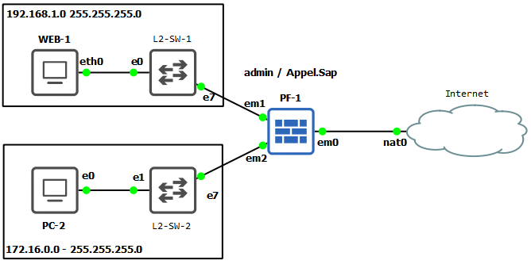
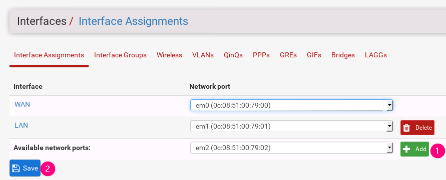
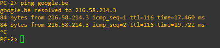

# Labo 06-02

In dit labo gaan we een netwerk toevoegen aan pfSense. Deze opstelling kan je vinden in [resources/gns3-labs/lab-06-02.gns3project.zip](../../resources/gns3-labs/lab-06-02.gns3project.zip).

## Installatie

Begin met pfSense te installeren en vervolledig de basis configuratie zoals je geleerd hebt in lab 2.2.

Kies naar wens je eigen waarden. Hou wel de _standaard waarden aan voor het ip adres van em1_.

## Een interface toevoegen aan pfSense

Het eerste wat we moeten doen is een nieuwe interface toevoegen aan pfSense. Ga hiervoor naar **`Interfaces > Assignments`**. Klik rechtsonder op Add en dan op Save:

Ga nu naar **interfaces > OPT1**. Vul hier de volgende waarden in:

- Enable
    - Aanvinken
- IPv4 Configuration type
    - Static IPv4
- IPv4 Address
    - 172.16.0.1 / 24

Klik onderaan op **`save`**. Er wordt nu nu gevraagd om de wijzigingen door te voeren. Klik op **`Apply changes`**.

## Verkeer van het nieuwe netwerk door de firewall laten

Het enige wat nog resteert is de firewall aanpassen. Ga hiervoor naar **`Firewall > Rules`**. Selecteer bovenaan OPT1. Klik onderaan op een van de **`Add`** knoppen. In dit geval maakt het niet uit welke van de 2 je gebruikt.

Pas de volgende waarde aan:

- Protocol
    - Any
- Source
    - OPT1 net
- Description
    - Allow network 2 access

## Testen vanaf PC-2

Als alles goed verlopen is kan je nu vanaf PC-2 google pingen:

