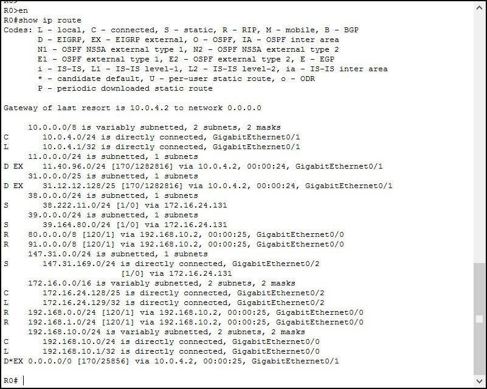

# Labo 08-01

## Opdracht 1

Open een cmd venster op jouw pc en voer het commando "`route print -4`" uit.

- Welk ip wordt gebruikt voor jouw default gateway?
- Welke interface wordt er gebruikt om de default gateway te benaderen?

## Opdracht 2

Welke zijn de next-hop, AD en metric voor de volgende ip's:

- `192.168.10.5`
- `80.105.10.2`
- `9.9.9.9`

## Opdracht 3

Een router heeft de volgende 3 routes in de RIB staan. Welke route wordt in de FIB geïnstalleerd voor 10.0.0.10 te bereiken? Leg uit hoe je tot deze conclusie bent gekomen.

- `10.0.0.0/24 [110/200] via 172.16.0.1, GigabitEthernet 0/1`
- `10.0.0.0/24 [90/5] via 172.16.0.1, GigabitEthernet 0/1`
- `10.0.0.0/24 [110/4] via 172.16.0.1, GigabitEthernet 0/1`
- `10.0.0.0/26 [120/10] via 172.16.0.1, GigabitEthernet 0/1`

## Opdracht 4

Welke route uit bovenstaande opdracht wordt als volgende kandidaat beschouwd? Sorteer de routes volgens preference.