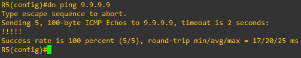

# Labo 08-02


In dit labo gaan we werken met static routing. Deze opstelling kan je vinden in [resources/gns3-labs/lab-08-02.gns3project.zip](../../resources/gns3-labs/lab-08-02.gns3project.zip).

We beginnen met ons even bekend te maken met enkele commando's. Verbind hiervoor met R5. Voer de volgende commando's uit:

```
enable
configure terminal
```

Je bevindt je nu in de configuratiemodus van de router. Vanaf hier kan je verschillende stukken informatie opvragen en het nodige instellen. Begin met het commando "`do show ip interface brief`" uit te voeren.

Je krijgt nu alle interfaces te zien van de router en bijbehorende ip adressen:


Druk het netwerk schema af of teken dit even na op papier. Vermeld bij elke interface het juiste ip adres. Dit vergemakkelijkt je het configureren later.

Voer nu het commando "`do show ip route`" uit. Je krijgt nu de routetabel van de router te zien:


Zoals je kan zien heeft de router alle **directly connected** netwerken al aangeleerd. Wanneer je nu een ping test doet maar 10.0.0.17 kan je zien dat deze werkt. Je doet dit met "`do ping 10.0.0.17`"


Dat de eerste ping mislukt is normaal. Dit is omdat er nog vlug een ARP request wordt uitgestuurd.

We gaan nu zorgen dat R5 het netwerk van PC-4 kan bereiken. Hiervoor moeten we eerst weten welk ip adres R4 heeft op G0/2. We vragen dit even op en zien dat dit **10.0.0.21** is.

_Je kan dit zo ook afleiden sinds dit een /30 subnet is._

We weten dus dat we **via 10.0.0.21** en interface **G0/2** dit netwerk kunnen bereiken. We stellen de route in met het volgende commando:

```
ip route 192.168.4.0 255.255.255.0 G0/2 10.0.0.21
```

Als we nu de routetabel opvragen zien we dat de route geïnstalleerd is:


Je kan nu ook vanaf R5 PC-4 pingen:


# Opdracht 1

Zorg dat R5 nu ook PC-3 kan bereiken


# Static routing verder dan 1 hop

Stel nu op R5 de route in naar PC-1. Wanneer je nu test kan je zien dat dit niet lukt:


De reden is dat je met statische routes moet zorgen dat elke router op de weg moet weten hoe waar het packet naartoe moet.


Route 1 hebben we reeds ingesteld. We moeten nu zorgen dat R3 dit ook weet en R1 ook het nodige weet.

We moeten nu even de nodige routes instellen op R3. Stel op R3 de volgende route in:


```
ip route 192.168.1.0 255.255.255.0 g0/1 10.0.0.1
```


Stel op R1 de volgende route in:


```
ip route 10.0.0.16 255.255.255.252 G0/1 10.0.0.2
```


Stel op R5 de volgende route in:


```
ip route 192.168.1.0 255.255.255.0 GigabitEthernet0/3 10.0.0.17
```


Als je nu de ping test doet vanaf R5 kan je zien dat dit wel werkt:


# Opdracht 2

Zorg er voor dat nu alle VPCS elkaar kunnen pingen.


# Gateway of last resort

We willen nu PC-4 voorzien van internet toegang. Hiervoor moeten we een gateway of last resort hebben.

We beginnen met deze in te stellen op R5:

```
ip route 0.0.0.0 0.0.0.0 G0/9 192.168.122.1
```

Als je vanaf R5 nu pingt naar het internet werkt dit:



We stellen dit nu ook in op R4. We gebruiken R5 als default gateway:

```
ip route 0.0.0.0 0.0.0.0 G0/2 10.0.0.22
```

_R5 is reeds ingesteld met NAT. In latere hoofdstukken gaan we hier dieper op in._

Je kan nu zien dat je ping test slaagt:

