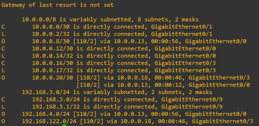

# Labo 08-03


In het vorige labo werkten we met static routing. Je zal wel gemerkt hebben dat dit redelijk intensief is qua configuratie.

In dit labo gaan we werken met dynamic routing. We gebruiken hiervoor ospf. Download even labo 9.2 opnieuw en sla dit op als labo 9.3.

Je kan dit labo vinden in [resources/gns3-labs/lab-08-02.gns3project.zip](../../resources/gns3-labs/lab-08-02.gns3project.zip).


## Opdracht 1

Stel op R5 de gateway of last resort in richting het internet en doe een ping test ter verificatie.


# Dynamic routing instellen op R3, R4 en R5

Voer de volgende commando's uit op R3, R4 en R5


```
enable
configure terminal

ip routing

router ospf 10
network 10.0.0.0 0.0.0.255 area 0
network 192.168.0.0 0.0.255.255 area 0

! de configuratie opslaan
do wr mem
```

Laat OSPF enkele seconden om alle informatie uit te wisselen. Als je nu de routetabel opvraagt van R3 zie je dat R3 de netwerken van R4 en R5 geleerd heeft:



## Opdracht 2

Stel ook even R1 en R2 in.


# De default gateway propageren

We hebben nu een netwerk waar we volledig kunnen pingen. Maar onze routers hebben nog geen default gateway. Dit is iets wat we makkelijk kunnen oplossen met een routing protocol.

Voer hiervoor op R5 de volgende commando's uit:


```
enable
configure terminal

router ospf 10
default-information originate

! de configuratie opslaan
do wr mem
```


R5 gaat nu aan alle routers in hetzelfde area laten weten dat hij een default gateway ter beschikking heeft. De andere routers gaan deze nu automatisch gebruiken. Als je nu de routetabel op R3 opvraagt zie je dat deze een default gateway heeft. Ping testen naar het internet werken ook:


## Opdracht 3

Schakel nu R3 uit en beantwoord en bekijk de routetabel van R1 en R2. Wat is er veranderd?
