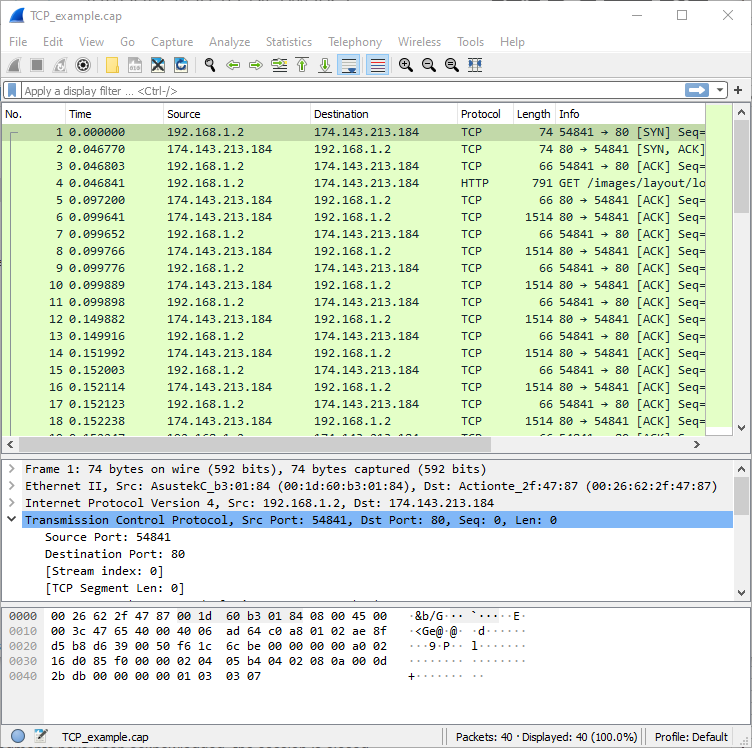
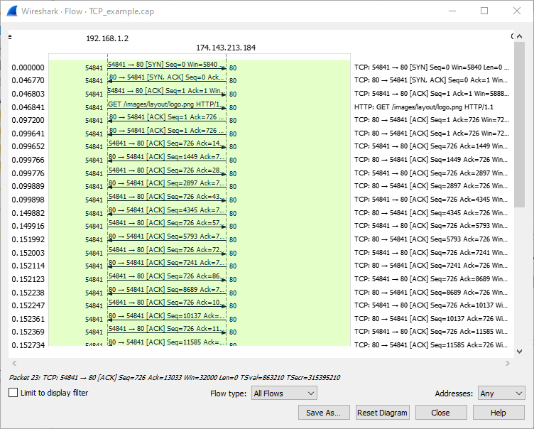
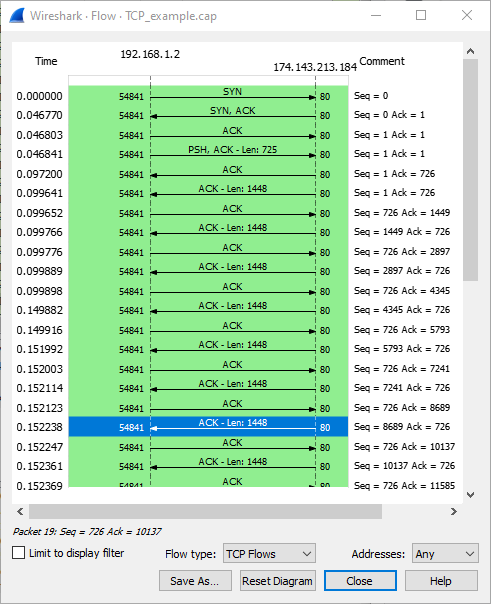

# Labo 09-01

## Wireshark gebruiken om tcp flows in beeld te brengen
In dit hoofdstuk hebben we gekeken hoe TCP betrouwbaar data verstuurd. In dit lab gaan we in depth eens kijken hoe zo een stream er uit ziet. Laad de TCP_example.pcap file in.

Wanneer je deze met wireshark opent krijg je het volgende te zien:

Kies nu bovenaan voor statistics -> flow graph en je krijgt het volgende venster te zien:

Kies onderaan nu als flow type TCP flows en je krijgt een mooi overzicht te zien. Leuk is ook dat wanneer je in dit overzicht een transmissie selecteert wireshark automatisch ook dezelfde transmissie selecteert in het hoofdvenster voor wanneer je in detail wil treden.

