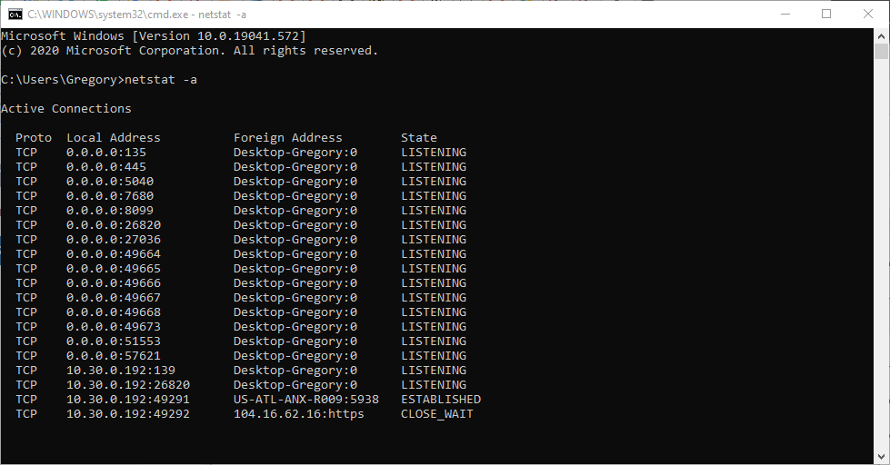
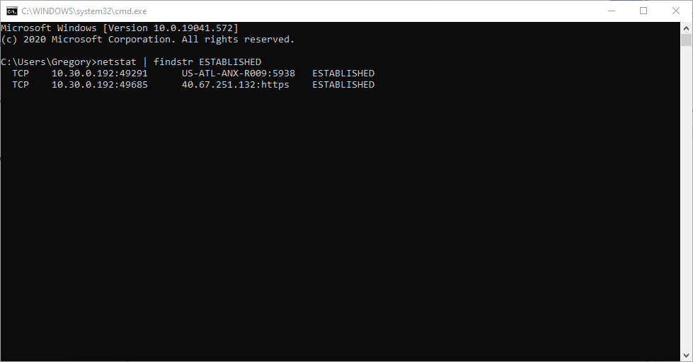
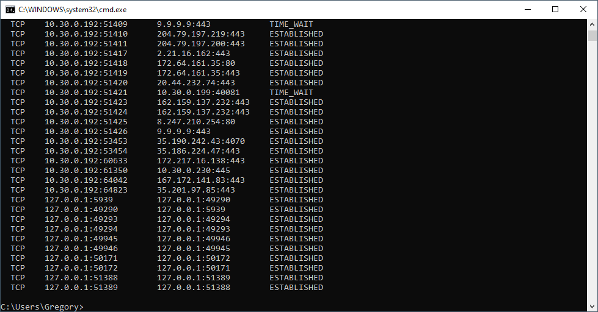
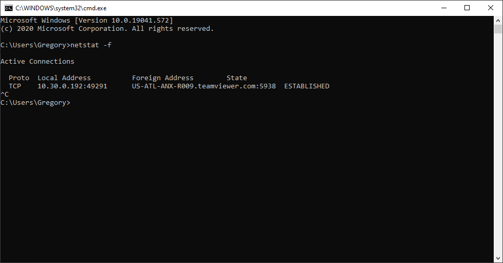
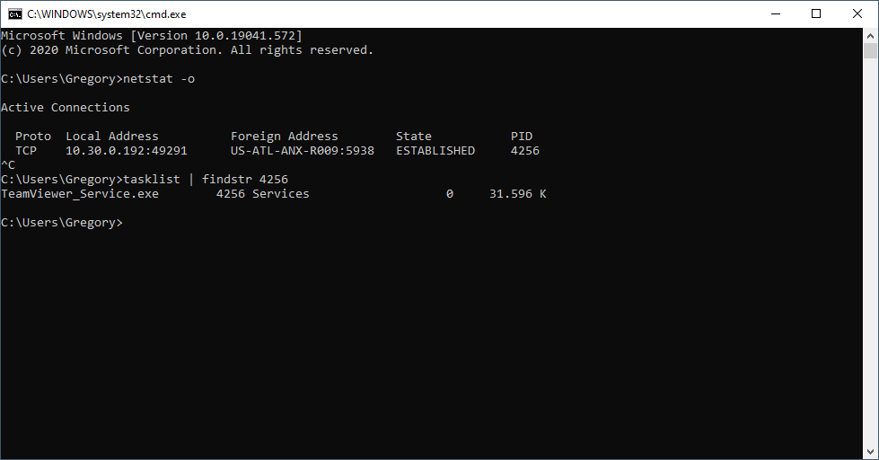
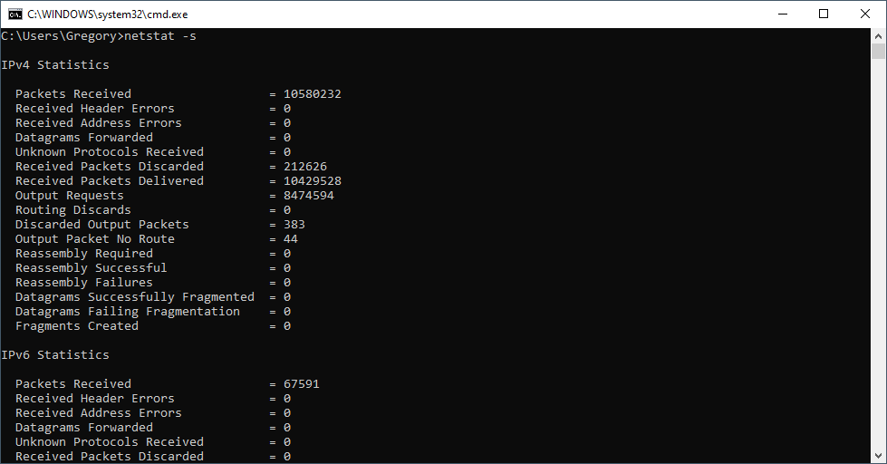
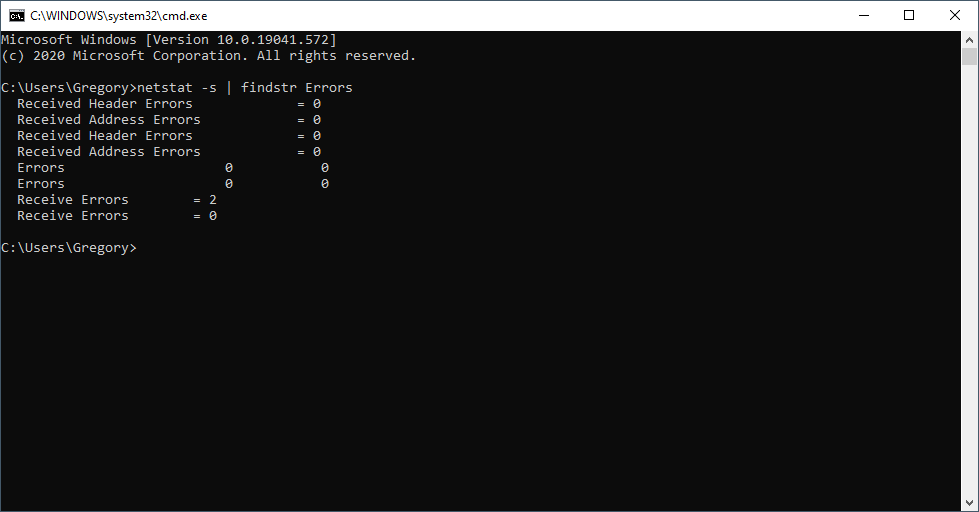
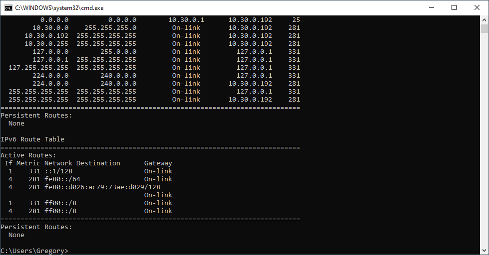

# Labo 09-02

Netstat is een command line tool die je toelaat om verschillende netwerk items te troubleshooten. We behandelen in dit lab de windows variant. Je hebt ook in linux en osx netstat maar het kan zijn dat de opties hier iets anders zijn.

## Alle connecties tonen

Je kan alle open connecties tonen met het "**`netstat -a`**" commando. Je ziet hier ook connecties bij verschijnen als je extra connecties opent. Je kan dit sluiten met "`ctrl + c`"

## Alleen established connecties tonen

Established connecties zijn verbindingen die momenteel opgezet zijn en data aan het versturen zijn.

Je kan deze opvragen met het "`netstat | findstr ESTABLISHED`" commando. Op dezelfde manier kan je ook listening, waiting en andere connecties filteren.

## Netstat de pure ip adressen laten weergeven ipv hostnames

Gebruik hiervoor "`netstat -n`". Je kan dit ook combineren met andere flags van netstat. Zo kan je alle connecties met ip adres weergeven met het "`netstat -na`" commando.

## De volledige domain name weergeven van connecties

Dit doe je met het "`netstat -f`" commando.

## Opvragen welk programma welke poort/verbinding in gebruik heeft

Vraag eerst een lijst van alle established connecties op met bijhorende process id's. Dit doe je met het "`netstat -o`" commando. Als je alle listening connecties ook wilt dan gebruik je "`netstat -ao`".

In de lijst krijg je nu rechts de PID (Process ID) te zien die een connectie in gebruik heeft. Je kan nu met deze PID opvragen welk programma dit is met het "`tasklist | findstr &lt;PID>`" commando.

## Statistieken per protocol opvragen

Soms wil je weten of je veel packet loss hebt of andere statistieken. Dit kan je met het "`netstat -s`" commando.

Je kan makkelijk ook gewoon alle lijnen met errors tonen met het "`netstat -s | findstr Errors`" commando.

## De routetabel opvragen

De routetabel kan je met het "`netstat -r`" commando opvragen.

