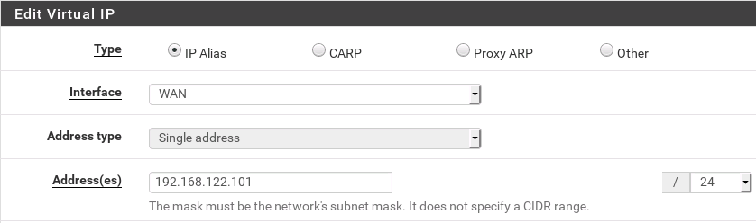
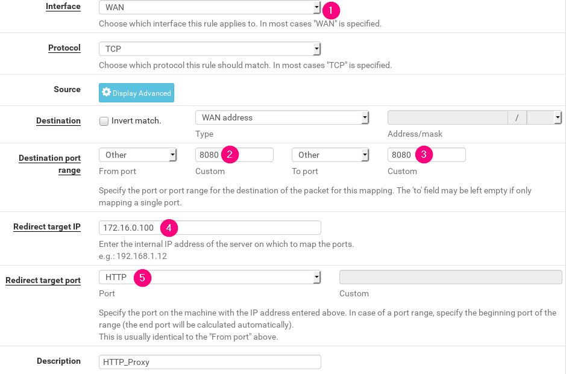
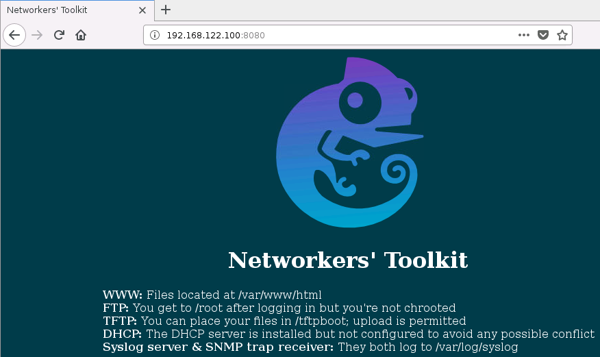

# Labo 10-01

Deze opstelling kan je vinden in [resources/gns3-labs/lab-10-01.gns3project.zip](../../resources/gns3-labs/lab-10-01.gns3project.zip).

In dit labo gaan we enkele basis NAT instellingen bekijken en instellen in een pfSense firewall.

## Opdracht 1

Download de opstelling en installeer de pfSense firewall. 

- Disable het blocken van RFC1918 netwerken.
- Stel het juiste LAN ip meteen in

Zodra je de basis instellingen correct hebt doorgevoerd moet je met het nieuwe beheer ip verbinden. Het makkelijkste is om gewoon even WEB-2 te herstarten zodat deze een nieuw ip aanvraagt.

## Opdracht 2

Stel op de WAN interface het eerste IP in. Je vindt de instellingen onder **`Interfaces > WAN`**.

Stel ook de gateway correct in.

## Opdracht 3

Ga naar **`Firewall > Virtual IPs`**. Voeg een nieuw virtual IP toe op de WAN interface met het 2de ip adres.

## Opdracht 4

Maak een port forward aan. Ga hiervoor naar **Firewall > NAT**. Voeg een nieuwe rule toe. Gebruik de volgende instellingen:

Dit zorgt er voor dat alle trafiek die binnenkomt op het eerste WAN ip op poort 8080 geforward wordt naar de webserver. pfSense maakt automatisch de firewall rule aan voor jouw NAT rule.

Als je nu surft naar **`192.168.122.100:8080` op WEB-1** krijg je de volgende pagina te zien:

## Opdracht 5

Stel nu een 1:1 nat in. Ga hiervoor weer naar **Firewall > NAT**. Voeg een nieuwe 1:1 rule toe. Gebruik de volgende instellingen:

Als je nu met WEB-1 surft naar **192.168.122.101 zonder een extra poort** dan zie je dat de webpagina ook gewoon werkt.
