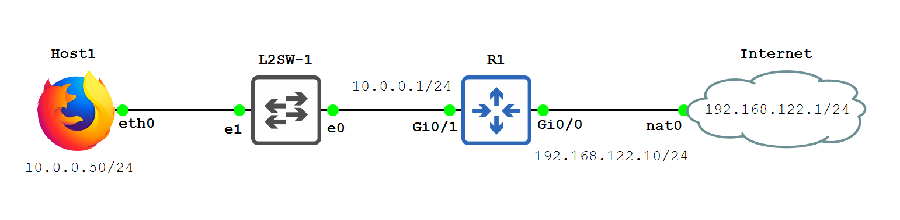

# Labo 10-03

Deze opstelling kan je vinden in [resources/gns3-labs/lab-10-03.gns3project.zip](../../resources/gns3-labs/lab-10-03.gns3project).



In dit labo configureren we PAT op een cisco router.

Alle interfaces zijn reeds voorzien van de juiste ip adressen. Tevens zijn alle routes al juist geconfigureerd.

Wanneer we PAT willen configureren op een Cisco router hebben we enkele configuratie items nodig:

- We moeten aangeven welke interfaces `inside` en `outside` ons netwerk liggen
- We moeten configureren welke netwerken gebruik mogen maken van PAT met een `access list`
- We moeten de juiste interface configureren die als interface gebruikt gaat worden voor PAT `overload`

## Opdracht 1

Start alle apparaten op. Controleer of R1 kan pingen naar de gateway `192.168.122.1`.

Controleer of Host1 kan pingen naar `10.0.0.1`.

## Opdracht 2

We starten met aan te geven welke onze `inside` en welke onze `outside` interfaces zijn. In het geval van deze opstelling is op `R1` de interface `G0/0` onze `outside` interface en is `G0/1` onze `inside interface`.

Om dit te configureren moeten we op de juiste interface werken met het `ip nat inside|outside` commando. Om beide interfaces correct te configureren gebruiken we de volgende commando's

```
configure terminal

interface g0/0
ip nat outside

interface g0/1
ip nat inside

exit
```

## Opdracht 3

De 2de stap is het bouwen van een `access-list` waarin we bepalen welke netwerken of ip adressen mogen gebruik maken van PAT.

Hoe Access lists werken is nu even niet van belang. Weet dat we gewoon gebruik maken van een standard access-list om beslissingen te maken aan de and van source ip addressen. We maken een access list aan die `10.0.0.0/24` toelaat.

**Let op:** het subnetmasker is geen typfout. Access lists maken gebruik van wildcard masks. Dit is het omgekeerde van een subnetmasker (`255.255.255.0` wordt dan `0.0.0.255`)

```
ip access-list standard ALLOW_PAT
permit 10.0.0.0 0.0.0.255

exit
```

## Opdracht 4

We schakelen nu PAT in. We doen dit door gebruik te maken van de access list die we zonet hebben geconfigureerd. Het volgende commando voegt alles samen:

```
ip nat inside source list ALLOW_PAT interface G0/0 overload
```

Met dit commando zeggen we nu dat alle ip's in het `10.0.0.0/24` netwerk gebruik mogen maken van PAT via interface G0/0. De `overload` optie bepaalt dat er gebruik wordt gemaakt van PAT. Indien we dit niet doen maken we gebruik van **dynamic natting**. (voor dynamic natting moet je wel een pool aanmaken indien je meerdere wan ips hebt)

Als alles goed verlopen is kan `Host1` nu het internet bereiken. Je kan controleren of NAT goed werkt door op `R1` alle NAT vertalingen op te vragen:

```
do show ip nat translations
```

## Opdracht 5

Open wireshark tussen R1 en de nat cloud. Wat kan je zien? Kan je zien waar en hoe PAT wordt toegepast?

## Opdracht 6

`PC1` wil kunnen pingen naar `Host1`. Dit gaat echter niet omdat momenteel NAT (PAT) is ingeschakeld op `R1`. We moeten dus expliciet een forwarding doen van deze trafiek naar `Host1`.

Dit is net hetzelfde zoals het internet bij jou thuis. Men kan ook niet zomaar binnen op jouw netwerk.

De oplossing is om gebruik te maken van **static nat**. Je kan dit doen met het volgende commando op `R1`:

```
ip nat inside source static 10.0.0.50 192.168.122.10
```

Dit commando zorgt er voor dat alle verkeer dat ontvangen wordt door de `G0/1` interface van `R1` volledig wordt doorgestuurd naar `Host1`.

`PC1` kan nu `Host1` door te pingen naar het WAN ip van `R1`, dus naar `192.168.122.10`.

## Opdracht 7

Start wireshark tussen `L2SW-1` en `Host1` en filter op `icmp` trafiek. Ping nu van `PC1` naar `Host1`. Kan je zien hoe de static nat werkt?