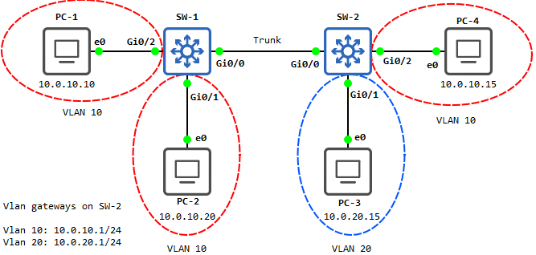
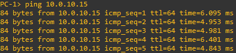
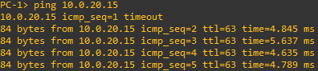

# Labo 11-01

Deze opstelling kan je vinden in [resources/gns3-labs/lab-11-01.gns3project.zip](../../resources/gns3-labs/lab-11-01.gns3project.zip).



## VLANs aanmaken

We maken eerst op SW-1 en SW-2 de nodige vlans aan. Hiervoor gebruiken we de volgende configuratie commando's op **SW-1 en SW-2**:


```
vlan 10
name vlan_werkvloer
exit
vlan 20
name vlan_boekhouding
```


Je kan nu nakijken of de vlans bestaan met het "`show vlan`" commando.


## Vlans toepassen op poorten

We gaan nu de vlans toepassen op poorten. Gebruik de volgende commando's op **SW-1**:


```
interface G0/1
switchport mode access
switchport access vlan 10

interface G0/2
switchport mode access
switchport access vlan 10
```


En de volgende commando's op **SW-2**:


```
interface G0/1
switchport mode access
switchport access vlan 20

interface G0/2
switchport mode access
switchport access vlan 10
```


## Ping tests

Je kan nu pingen van PC-1 naar PC-2 maar niet maar PC-4. De reden is dat de communicatie tussen de switches nog niet in orde is.


## Een trunk instellen

We gaan nu een trunk instellen waar beide vlan's over mogen communiceren. Voor hiervoor op **SW-1 en SW-2** de volgende commando's uit:


```
interface g0/0
switchport trunk encapsulation dot1q
switchport mode trunk
switchport trunk allowed vlan 10,20
```


Als alles correct verlopen is kunnen PC-1 en PC-2 nu PC-4 pingen.



## Inter-vlan routing

Alleen kunnen onze 2 netwerken nu nog niet communiceren. Hiervoor moeten we inter vlan routing inschakelen. Gebruik op **SW-1 en SW-2** het volgende commando:


```
ip routing
```


We moeten nu een switch kiezen waar we onze gateways gaan aanmaken. We kiezen in dit geval voor **SW-2**. Voer de volgende commando's uit:


```
interface vlan 10
ip address 10.0.10.1 255.255.255.0
no shut

interface vlan 20
ip address 10.0.20.1 255.255.255.0
no shut
```


Je kan nu pingen van PC-1, PC-2 en PC-4 naar PC-3

