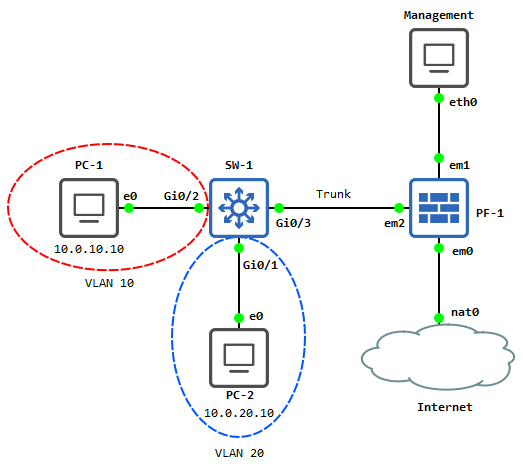
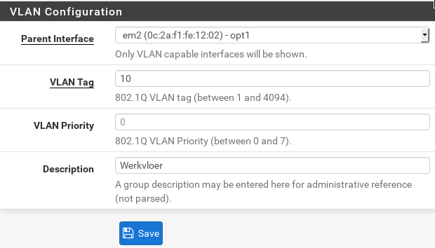
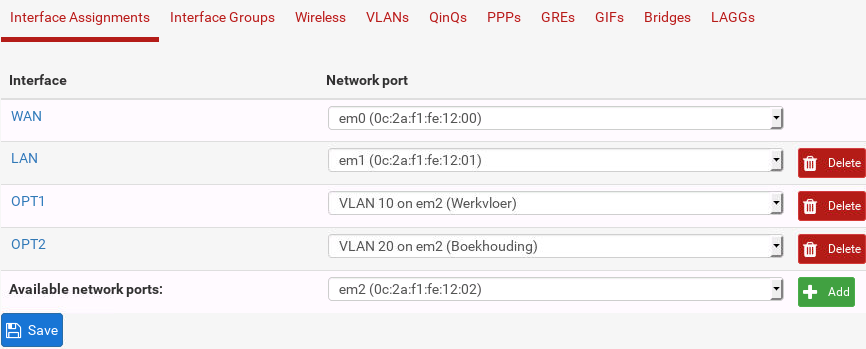
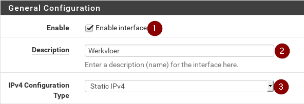
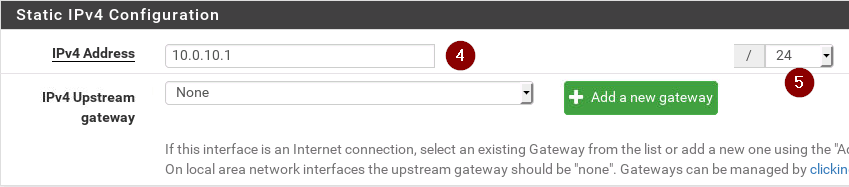
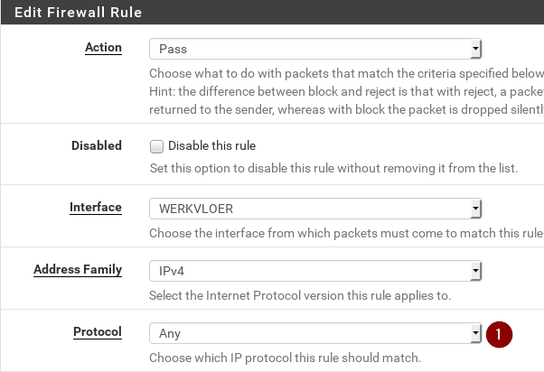
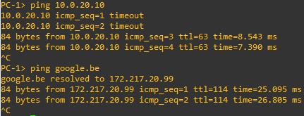

# Labo 11-02


Deze opstelling kan je vinden in [resources/gns3-labs/lab-11-02.gns3project.zip](../../resources/gns3-labs/lab-11-02.gns3project.zip).

In dit labo gaan we een pfSense firewall gebruiken voor routing on a stick toe te passen tussen onze vlans.



## Opdracht 1

Installeer een basis pfsense.


## Vlans instellen op SW-1

We stellen de vlans in op SW-1 en maken een trunk aan naar PF-1. We gebruiken hiervoor de volgende configuratie commando's:


```
! Vlans aanmaken
vlan 10
name vlan_werkvloer
exit
vlan 20
name vlan_boekhouding

! Interfaces toekennen aan vlans
interface G0/1
switchport mode access
switchport access vlan 20

interface G0/2
switchport mode access
switchport access vlan 10

! De trunk instellen
interface g0/3
switchport trunk encapsulation dot1q
switchport mode trunk
switchport trunk allowed vlan 10,20
```

## pfSense instellen

We moeten de volgende stappen doorlopen


1. De nodige vlans aanmaken en toekennen aan onze een interface
2. Een extra interface in gebruik stellen voor elk vlan
3. De nodige firewall rules instellen zodat we de communicatie toelaten

Ga naar **interfaces > Interface Assignments**. Klik nu bovenaan op vlans. Voeg vlan **10 en vlan 20** toe. Koppel deze aan de juiste parent interface:



Kies nu bovenaan voor **interface assignments**. Maak een interface aan voor zowel vlan 10 als vlan 20:



Ga nu naar **Interfaces > OPT1**. Enable deze interface en stel het volgende in:





Doe **hetzelfde nu voor OPT2** maar noem deze **boekhouding **en geef deze als ip **10.0.20.1/24**.

Als laatste moeten we nu voor beide vlans de communicatie toelaten. Ga hiervoor naar **firewall > rules**. Klik bovenaan op **werkvloer** en klik dan op **add**. Stel dit als volgt in:



De rest van de instellingen laat je standaard staan. Klik onderaan op **save** en dan op **apply bovenaan**.

Doe hetzelfde voor **boekhouding**.

Als alles nu correct verlopen is kunnen beide netwerken elkaar pingen en heb je ook internet toegang:

