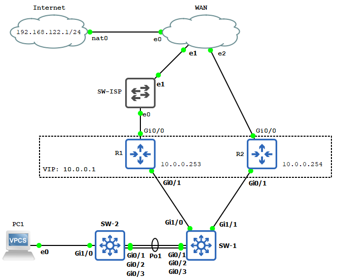
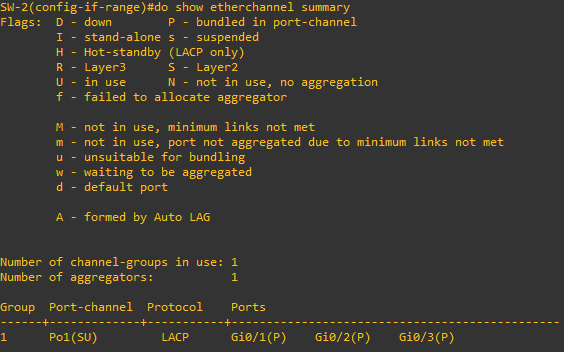
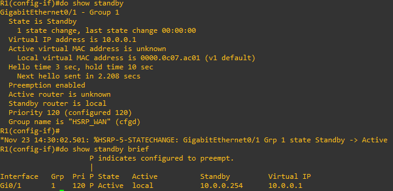

# Labo 12-01

Deze opstelling kan je vinden in [resources/gns3-labs/lab-12-01.gns3project.zip](../../resources/gns3-labs/lab-12-01.gns3project.zip).




In dit labo gaan we met LACP een LAG opzetten en gaan we als FHRP gebruik maken van HSRP.


# Opzetten van de LACP LAG

Voer de volgende configuratie commando's uit op zowel SW-1 als SW-2:

```
interface range Gi0/1 - 3
channel-group 1 mode active
```

Je hebt nu een LACP LAG aangemaakt tussen beide switches. Je kan dit verifieren met het volgende commando:

```
show etherchannel summary
```



## Opdracht 1

Schakel nu gerust 1 of 2 van de links uit van de LAG tussen SW-1 en SW-2. Verifieer nogmaals status van de LAG.


# Opzetten van een FHRP met HSRP

Voor HSRP te configureren moeten we op elke router het standby IP instellen. We geven beide routers ook een andere priority zodat R1 de forwarding router wordt. Voer de volgende configuratie commando's uit op **R1**:


```
int g0/1
standby 1 ip 10.0.0.1
standby 1 name HSRP_WAN
standby 1 priority 120
standby 1 preempt
```

En de volgende commando's op **R2**:

```
int g0/1
standby 1 ip 10.0.0.1
standby 1 name HSRP_WAN
standby 1 priority 110
standby 1 preempt
```


Zoals je kan zien maken we ook gebruik van **preemption**.

Je kan de status van HSRP opvragen met de volgende commando's:


```
show standby
show standby brief
```



## Opdracht 2

Sla de configuratie op beide routers op met het "`wr mem`" commando. Voer met PC1 een ping test uit naar het VIP.


## Opdracht 3

Open met wireshark de link tussen SW-1 en R-2. Schakel nu R1 uit. Wat zie je? Wat is er veranderd wanneer je de standby status opvraagt op R2?


## Opdracht 4

Doe een ping test nu van PC1 naar het VIP. Wat is er veranderd op PC1?


# 


# Object tracking

Indien je wenst kan je ook eens met object tracking spelen.


## Interface status tracking op R1

Voer de volgende configuratie commando's uit op R1:


```
track 5 interface g0/0 line-protocol
int g0/1
standby 1 track 5 decrement 30
```


Hiermee volgende we de status op van G0/0 op R1. Indien deze interface down gaat verlagen we de HSRP priority van R1 met 30. Test dit even door de link uit te schakelen.

Dit is een heel basisvorm van object tracking. Het grootste nadeel is dat dit geen rekening houdt met echte connectiviteit maar gewoon met de status van de interface. Stel nu dat de link tussen SW-ISP en WAN uitvalt gaat dit niets uit maken.


## IP tracking op R1

Een oplossing is dat we een ip adres op het internet gaan gebruiken als test. Verwijder hiervoor eerst de eerdere configuratie op R1:


```
int g0/1
no standby 1 track 5 decrement 30
```


Voer op R1 nu de volgende configuratie commando's uit:


```
ip sla 1
icmp-echo 9.9.9.9 source-ip 192.168.122.100
frequency 5
exit
ip sla schedule 1 life forever start-time now

track 10 ip sla 1 state

int g0/1
standby 1 track 10 decrement 30
```


Hiermee voeren we oneindig om de 5 seconden een ping uit naar 9.9.9.9. Als dit niet bereikbaar is verlagen we de prioriteit van R1.

Je kan de status van jouw SLA opvragen met de volgende commando's:


```
show ip sla statistics
show ip sla summary
show ip sla configuration
```


Test dit eens door nu de link uit te schakelen tussen SW-ISP en WAN en enkele seconden te wachten.
