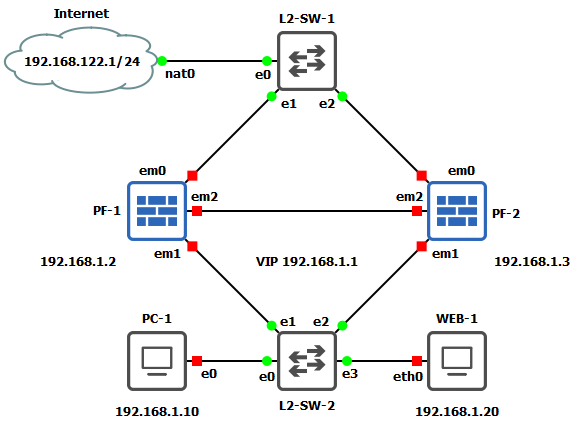

# Labo 12-02

Deze opstelling kan je vinden in [resources/gns3-labs/lab-12-02.gns3project.zip](../../resources/gns3-labs/lab-12-02.gns3project.zip).

## Opdracht 1
Installeer beide pfSense toestellen. Mogelijks ga je enkele aparte verbindingen moeten opzetten zodat je niet met IP conflicten geconfronteerd word. Je kan ook het LAN ip instellen tijdens de installatie.

## Opdracht 2
Probeer aan de hand deze documentatie CARP te implementeren met pfSense. Hou rekening met het feit dat niet alle IP adressen uit de documentatie overeenkomen met het labo. 

https://docs.netgate.com/pfsense/en/latest/recipes/high-availability.html
